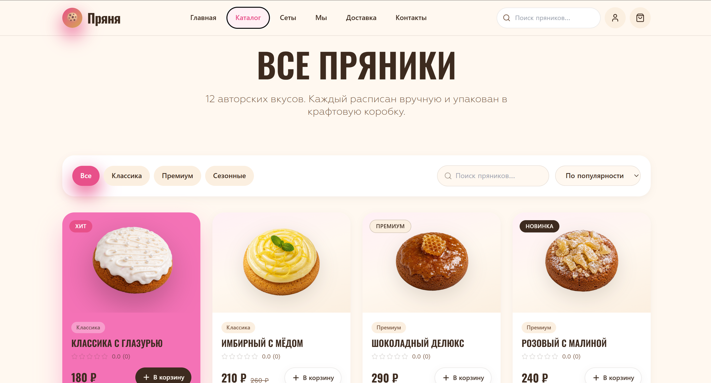
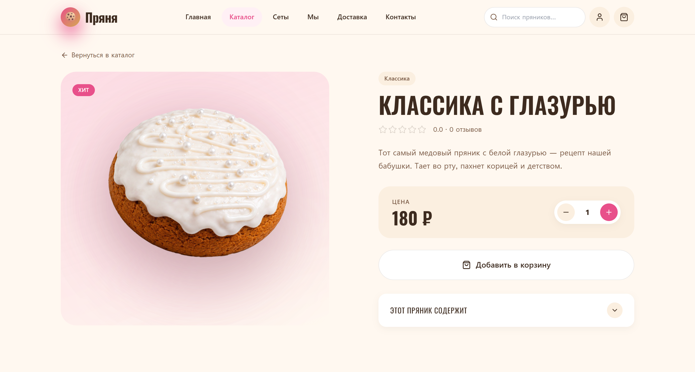
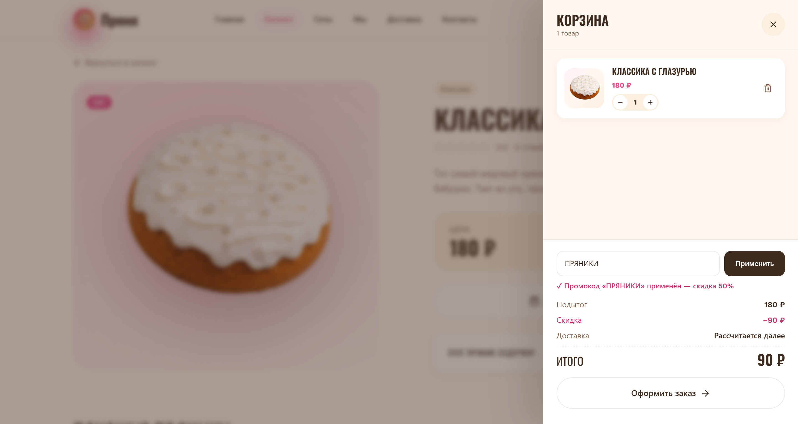
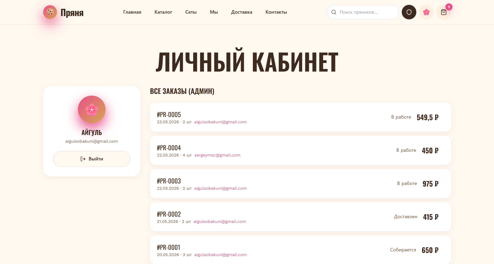
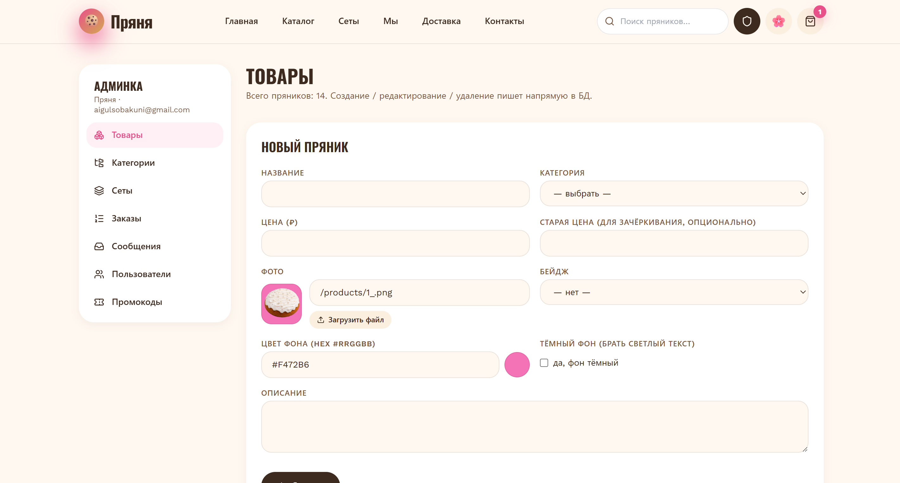

# Пряня

##ссылка на сайт - https://pryaniki.netlify.app/##

Интернет-магазин авторских пряников. Учебный full-stack проект, выполненный в рамках курсовой работы по дисциплине «Базы данных».


## О проекте

«Пряня» представляет собой рабочий интернет-магазин, написанный с нуля. Проект охватывает весь цикл разработки: проектирование реляционной схемы, REST API, клиентское приложение и панель администратора.

Основной акцент сделан на проектировании базы данных с правилами целостности и на типобезопасности кода на всём пути от запроса к базе до React-компонента.

> Проект учебный и некоммерческий. Все изображения товаров и логотип сгенерированы нейросетью, реальные фотографии и бренды не использованы. Названия и цены вымышлены.

## Скриншоты

### Главная страница


### Каталог и карточка товара

| Каталог | Карточка товара |
|---------|-----------------|
|  |  |

### Корзина, оформление заказа и админ-панель

| Корзина | Оформление заказа | Админ-панель |
|---------|-------------------|--------------|
|  |  |  |

## Возможности

Витрина для покупателя:

- Каталог пряников с категориями, фильтрами и бейджами (Хит, Новинка, Сезонный, Премиум).
- Подарочные наборы из нескольких товаров.
- Карточка товара с составом, отзывами, рейтингом и похожими позициями.
- Корзина и оформление заказа с промокодами и адресами доставки.
- Регистрация и личный кабинет: профиль, адреса, история заказов.
- Отзывы и оценки товаров.

Админ-панель для управления магазином:

- Управление товарами, категориями и наборами, включая загрузку изображений.
- Обработка заказов и смена их статусов.
- Промокоды, пользователи и входящие сообщения.

## Технологии

### Клиент

| Технология | Назначение |
|---|---|
| React 19 + TypeScript | Компонентный интерфейс и строгая типизация, снижающая число ошибок на этапе написания кода. |
| Vite | Быстрая сборка и горячая перезагрузка, современная альтернатива Create React App. |
| Tailwind CSS | Вёрстка по дизайн-системе из Figma без разрастания отдельных CSS-файлов. |
| Zustand | Управление состоянием корзины и авторизации с минимумом шаблонного кода. |
| React Router | Клиентская маршрутизация для одностраничного приложения. |
| Axios | HTTP-запросы к API с перехватчиками и поддержкой cookie-авторизации. |

### Сервер

| Технология | Назначение |
|---|---|
| Express | Минималистичный фреймворк для REST API. |
| Prisma ORM | Типобезопасный доступ к базе и автогенерация миграций по единой схеме. |
| PostgreSQL | Реляционная СУБД, ключевое требование курсовой по базам данных. |
| JWT в httpOnly-cookie | Авторизация без хранения токена в localStorage, что защищает от XSS. |
| bcrypt | Хеширование паролей, открытые пароли в базе не хранятся. |
| Zod | Валидация входящих данных на сервере, согласованная с типами TypeScript. |
| Multer | Загрузка изображений товаров через админ-панель. |

## База данных

Схема описана в Prisma и состоит из 16 таблиц и 3 перечислений. Центральные сущности: пользователи, товары, категории, наборы и заказы. Пользователь владеет заказами, адресами и корзиной. Каждый заказ состоит из позиций, ссылающихся на товар или набор. Товары сгруппированы по категориям, связаны с ингредиентами и могут входить в подарочные наборы. К товарам относятся отзывы с оценками.

Проектные решения, на которые стоит обратить внимание:

- **Снапшоты в заказах.** Таблица `order_items` хранит копию названия, цены и фото товара на момент покупки (`name_snap`, `price_snap`, `photo_snap`), поэтому заказ остаётся корректным даже после изменения или удаления товара.
- **Правила удаления.** Поведение `onDelete` настроено по смыслу связи: `Restrict` для каталога, `Cascade` для пользовательских данных, `SetNull` для исторических ссылок.
- **Связи многие-ко-многим.** Реализованы через явные таблицы-связки с дополнительными полями: `product_ingredients` (порядок состава) и `set_items` (количество в наборе).
- **Денежные суммы в `Decimal`.** Тип `Decimal` вместо `float` исключает ошибки округления в ценах и итогах.
- **Денормализация для скорости.** Поля `rating_avg` и `reviews_count` хранятся в товаре, чтобы не пересчитывать агрегаты при каждом запросе каталога.
- **Индексы.** Расставлены на внешних ключах и полях сортировки, например `created_at` по убыванию для заказов.
- **Перечисления на русском.** Через Prisma `@map` значения статусов читаются прямо в базе.

Подробное описание схемы и обоснование решений находятся в [`docs/db-design.md`](docs/db-design.md), материалы к защите в [`docs/db-defense.md`](docs/db-defense.md).

## Структура проекта

```
pranya/
├── client/              Клиент (Vite + React + TS), http://localhost:5173
│   ├── public/products/    изображения товаров (сгенерированы ИИ)
│   └── src/
│       ├── components/     UI-компоненты (layout, home, product, checkout, admin)
│       ├── pages/          страницы витрины и админки
│       ├── store/          Zustand-сторы (корзина, авторизация)
│       └── lib/            API-клиент и утилиты
│
├── server/              Сервер (Express + Prisma), http://localhost:4000
│   ├── prisma/             schema.prisma, миграции, сид-данные
│   └── src/
│       ├── routes/         эндпоинты: auth, products, orders, sets
│       ├── middleware/     авторизация, обработка ошибок
│       └── lib/            jwt, пароли, Prisma-клиент
│
└── docs/                Документация курсовой и материалы к защите
```

## Запуск локально

Требования: Node.js 20+, PostgreSQL 15+, база данных PostgreSQL с именем `pranya`.

```bash
# 1. Сервер
cd server
npm install
cp .env.example .env          # пропишите DATABASE_URL и секреты
npm run prisma:migrate        # применить миграции
npm run db:seed               # заполнить тестовыми данными
npm run dev                   # API на http://localhost:4000

# 2. Клиент (в новом терминале)
cd client
npm install
npm run dev                   # приложение на http://localhost:5173
```

### Переменные окружения (`server/.env`)

| Переменная | Назначение |
|---|---|
| `DATABASE_URL` | строка подключения к PostgreSQL |
| `PORT` | порт API (по умолчанию `4000`) |
| `JWT_SECRET` | секрет для подписи JWT-токенов |
| `JWT_EXPIRES_IN` | срок жизни токена (`7d`) |
| `COOKIE_SECRET` | секрет для подписи cookie |
| `CLIENT_ORIGIN` | origin фронтенда для CORS |

## API

Все эндпоинты доступны под префиксом `/api`. В режиме разработки Vite проксирует запросы `/api/*` на бэкенд.

| Группа | Назначение |
|---|---|
| `auth` | регистрация, вход, профиль (JWT в httpOnly-cookie) |
| `products` | каталог, карточка товара, похожие |
| `categories` | список категорий |
| `sets` | подарочные наборы |
| `orders` | оформление и история заказов |
| `promo` | проверка промокодов |
| `content` | FAQ, команда |
| `upload` | загрузка изображений (админка) |

## Автор

Айгуль, студентка. Full-stack разработка (React + TypeScript, Node.js).

- GitHub: [uliauliabbbbb](https://github.com/uliauliabbbbb)
- Email: aigulsobakuno@gmail.com
