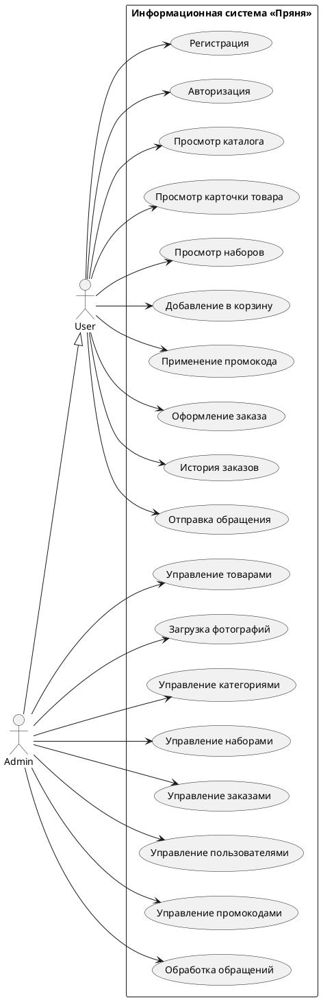

# Разработка информационной системы интернет-магазина авторских пряников «Пряня»

> Черновик основного текста курсовой работы по дисциплине «Базы данных».
> Структура соответствует приведённому оглавлению. Текст оформлен в академическом стиле и пригоден для прямого копирования в Word с последующим применением стилей шаблона методички.

---

## ВВЕДЕНИЕ

Электронная коммерция остаётся одним из наиболее динамично развивающихся сегментов цифровой экономики. Полнофункциональный интернет-магазин помимо витрины продукции включает в себя ряд бизнес-процессов: управление каталогом, оформление и обработку заказов, систему лояльности, обратную связь с покупателями и инструменты администрирования. Для корректной поддержки всех перечисленных функций необходима грамотно спроектированная реляционная база данных, обеспечивающая целостность данных, эффективность выполнения запросов и масштабируемость на этапе сопровождения.

**Актуальность работы** определяется тем, что разработка собственного интернет-магазина с нуля позволяет на практике закрепить принципы проектирования реляционных баз данных, нормализации, обеспечения ссылочной целостности и применения ограничений предметной области на уровне СУБД.

**Объектом исследования** является база данных интернет-магазина авторских пряников «Пряня».

**Предметом исследования** — методы и средства проектирования и реализации реляционной БД для систем электронной коммерции на основе СУБД PostgreSQL и ORM-инструмента Prisma.

**Цель работы** — спроектировать и реализовать информационную систему интернет-магазина «Пряня», включающую полнофункциональную базу данных, серверную часть с REST API и веб-интерфейс для покупателя и администратора.

Для достижения поставленной цели сформулированы следующие **задачи**:

1. Изучить предметную область — бизнес-процессы интернет-магазина пряников.
2. Сформировать функциональные и нефункциональные требования к системе.
3. Обосновать выбор технологического стека.
4. Спроектировать концептуальную, логическую и физическую модели базы данных, включая нормализацию до третьей нормальной формы и продуманные исключения (денормализация для снапшотов заказов).
5. Реализовать базу данных в СУБД PostgreSQL с использованием миграций и описать ограничения целостности.
6. Разработать серверный слой — REST API с авторизацией и разграничением прав доступа.
7. Реализовать клиентскую часть — публичный сайт-витрину и административную панель.
8. Подготовить инструкции по установке и эксплуатации системы.

**Методы исследования** — анализ предметной области, метод восходящего проектирования БД (от сущностей к связям), нормализация по правилам Кодда, тестирование функционала на уровне SQL-запросов и пользовательских сценариев.

**Практическая значимость** работы заключается в том, что разработанная система пригодна к развёртыванию в качестве пилотной версии действующего интернет-магазина либо использована как учебный материал для демонстрации архитектуры современных fullstack-приложений на стеке PostgreSQL/Node.js/React.

---

## ГЛАВА 1. ПРОЕКТИРОВАНИЕ

### 1.1 Описание предметной области

«Пряня» — учебный интернет-магазин авторских пряников. Витрина включает в себя двенадцать наименований пряников, объединённых в три категории (классические, премиальные, сезонные), а также подарочные наборы — комбинации из нескольких пряников, упакованные в коробку.

В системе выделяются три категории пользователей:

- **Гость** — неавторизованный посетитель, имеющий доступ к каталогу, карточкам товаров, страницам подарочных наборов, информационным разделам («О нас», «Доставка», «Контакты») и форме обратной связи. Гость может добавлять товары в корзину (хранится локально в браузере), но для оформления заказа обязан зарегистрироваться или авторизоваться.
- **Зарегистрированный пользователь** — клиент магазина. Имеет доступ к личному кабинету, истории заказов, может оформлять заказы, применять промокоды, оставлять отзывы.
- **Администратор** — сотрудник магазина. Обладает расширенными правами: управление каталогом (товары, категории, наборы), управление пользователями и их ролями, обработка заказов (смена статусов), управление промокодами, просмотр и обработка обращений с формы обратной связи.

Ключевые **бизнес-процессы**, поддерживаемые системой:

1. **Просмотр каталога.** Гость или клиент изучает ассортимент, применяет фильтры по категориям и сортировки по цене, рейтингу, популярности.
2. **Формирование корзины.** Пользователь добавляет в корзину одиночные пряники и/или подарочные наборы с указанием количества.
3. **Применение промокода.** Введённый код проверяется на активность и срок действия, после чего к сумме заказа применяется процентная скидка.
4. **Оформление заказа.** Авторизованный пользователь указывает контактные данные, адрес доставки, способ доставки и оплаты, формирует заказ. В момент оформления данные о товарах фиксируются в виде неизменяемого снапшота (наименование, цена, фотография на момент покупки).
5. **Обработка заказа.** Администратор отслеживает заказы по статусам: «В работе», «Собирается», «В пути», «Доставлен».
6. **Обратная связь.** Любой посетитель может отправить сообщение через форму контактов; администратор видит входящие сообщения в админ-панели с пометками «прочитано/непрочитано».

### 1.3 Выбор стэка технологий

Для реализации системы выбран современный fullstack-стек, обеспечивающий высокую скорость разработки, типобезопасность и удобство сопровождения.

**Система управления базами данных — PostgreSQL 18.**

Обоснование выбора:

- открытый исходный код, отсутствие лицензионных ограничений;
- полная поддержка стандарта SQL;
- развитая система ограничений целостности (PRIMARY KEY, FOREIGN KEY с разными режимами `ON DELETE`, CHECK, UNIQUE);
- встроенная поддержка пользовательских перечисляемых типов (`CREATE TYPE … AS ENUM`), что позволяет вынести ограничения предметной области (статусы, роли, типы бейджей) на уровень схемы;
- поддержка точных типов с фиксированной разрядностью (`NUMERIC(10,2)`), критичных для денежных значений;
- поддержка тайм-зональных значений времени (`TIMESTAMP WITH TIME ZONE`);
- развитая система индексов и оптимизатор запросов.

**Инструмент управления схемой и миграциями — Prisma 5.**

Поскольку основной задачей курсовой работы является **проектирование и создание реляционной базы данных**, особое значение имеет выбор инструмента, через который происходит описание схемы и применение её к СУБД. В качестве такого инструмента выбран Prisma — современный schema-first инструмент, основанный на принципе «декларативное описание структуры → автоматическая генерация стандартного SQL».

Принципиально важно подчеркнуть: **Prisma не является ORM в классическом смысле**. Классические ORM (Hibernate, Entity Framework, Active Record) скрывают SQL за слоем объектно-реляционной абстракции и динамически генерируют запросы во время выполнения, что нередко затрудняет понимание происходящего «под капотом». Prisma работает иначе: схема описывается в специальном декларативном языке (`schema.prisma`), который **компилируется в стандартные DDL-инструкции PostgreSQL** и сохраняется в виде обычных SQL-файлов в каталоге `prisma/migrations/<timestamp>_<имя>/migration.sql`. Эти файлы версионируются вместе с исходным кодом и в любой момент доступны для просмотра, ревизии и ручного исполнения через `psql` или pgAdmin.

Иными словами, Prisma в данном проекте выступает в роли **транслятора и системы контроля версий схемы**, а не «чёрного ящика, скрывающего SQL». Все ключевые архитектурные решения принимаются проектировщиком БД самостоятельно:

- выбор сущностей и определение их атрибутов;
- определение типов колонок (`VARCHAR(100)`, `NUMERIC(10,2)`, `TIMESTAMPTZ`, перечисляемые типы);
- проектирование связей между таблицами (один-ко-многим, многие-ко-многим через ассоциативные таблицы);
- задание политик каскадного удаления (CASCADE / RESTRICT / SET NULL) для каждой внешней связи отдельно;
- формулировка ограничений предметной области через CHECK;
- выбор колонок для индексирования с учётом ожидаемых запросов;
- нормализация и осознанные отступления от неё (снапшоты в `order_items`).

Prisma лишь автоматизирует **рутинную часть** работы — преобразование принятых решений в синтаксически корректный SQL и их применение к СУБД. Это позволяет сосредоточиться на проектировании, а не на ручном переписывании DDL при каждом изменении схемы. При необходимости миграции могут быть дополнены вручную написанным SQL — например, для триггеров, представлений или нестандартных индексов, которые Prisma не генерирует автоматически.

Дополнительные преимущества Prisma:

- **воспроизводимость** — последовательное применение всех миграций на чистой БД восстанавливает её до текущего состояния, что упрощает развёртывание на других машинах и при защите курсовой;
- **типобезопасность** — TypeScript-клиент генерируется автоматически из схемы, что устраняет целый класс ошибок (опечатки в названиях таблиц и колонок, неверные типы) на этапе компиляции;
- **защита от SQL-инъекций** — все параметры запросов передаются отдельно от тела запроса (prepared statements);
- **транзакции** через `prisma.$transaction()` — используются, например, при оформлении заказа (атомарное создание адреса, заказа и позиций) и при обновлении состава подарочного набора (удаление старых позиций + создание новых);
- **GUI-инструмент Prisma Studio** для визуального просмотра данных как альтернатива pgAdmin.

Таким образом, использование Prisma полностью соответствует учебной цели — научиться проектировать и создавать реляционную базу данных. Сама схема, её нормализация, выбор типов, ограничения и индексы проектируются вручную и сохраняются в человеко-читаемой форме; SQL-код миграций остаётся доступен и поддаётся анализу; работа с СУБД на уровне чистого SQL (через pgAdmin) не вытесняется, а дополняется удобным инструментом для рутинных операций.

**Серверная платформа — Node.js 20 + Express 4 + TypeScript 5.**

Node.js обеспечивает асинхронную обработку запросов и единый язык программирования на клиенте и сервере. Express — наиболее распространённый минималистичный веб-фреймворк. TypeScript добавляет статическую типизацию.

**Дополнительные серверные библиотеки:**

- `zod` — валидация входящих JSON-запросов по схеме (тип, длина строк, диапазон чисел);
- `bcrypt` — односторонний хэш паролей пользователей;
- `jsonwebtoken` — JWT-токены аутентификации в httpOnly-cookie;
- `cookie-parser`, `cors` — стандартные middleware для работы с cookie и cross-origin запросами;
- `multer` — обработка загрузки файлов (фотографии товаров);

**Клиентская платформа — React 19 + Vite 8 + TypeScript 5.**

React — наиболее распространённая библиотека для построения интерфейсов. Vite — современный сборщик с быстрым dev-сервером и HMR. Дополнительно используются:

- `react-router-dom` — клиентская маршрутизация (SPA);
- `zustand` — компактный store для глобального состояния (корзина, авторизация);
- `axios` — HTTP-клиент с поддержкой cookie;
- `tailwindcss` — utility-first CSS-фреймворк;
- `lucide-react` — иконки.

**Среда разработки** — Visual Studio Code, PowerShell, pgAdmin 4 для администрирования БД, Git для версионирования исходного кода.

---

## ГЛАВА 2. РАЗРАБОТКА ИНФОРМАЦИОННОЙ СИСТЕМЫ

### 2.1 Требования к информационной системе

#### Функциональные требования

**Подсистема каталога:**

- ФТ-1. Отображение списка товаров с фильтрацией по категории, поиском по названию и сортировкой (по популярности, цене, рейтингу).
- ФТ-2. Отображение детальной карточки товара с описанием, составом (ингредиенты), отзывами и блоком похожих товаров.
- ФТ-3. Отображение подарочных наборов с составом каждого набора в виде чипов с миниатюрами входящих пряников.

**Подсистема корзины и оформления заказа:**

- ФТ-4. Добавление товаров и наборов в корзину с указанием количества.
- ФТ-5. Применение промокода с автоматической проверкой активности и срока действия.
- ФТ-6. Оформление заказа авторизованным пользователем с указанием контактных данных, адреса и способа доставки.
- ФТ-7. Фиксация состава заказа в виде снапшота — название, цена и фотография товара сохраняются в момент покупки и не изменяются при последующем редактировании каталога.

**Подсистема аутентификации:**

- ФТ-8. Регистрация нового пользователя с проверкой уникальности email.
- ФТ-9. Авторизация по email и паролю с выдачей JWT-токена.
- ФТ-10. Личный кабинет с историей заказов.
- ФТ-11. Разграничение прав доступа: обычный пользователь / администратор.

**Подсистема администрирования:**

- ФТ-12. CRUD-операции над товарами, включая загрузку фотографий на сервер.
- ФТ-13. CRUD-операции над категориями.
- ФТ-14. CRUD-операции над подарочными наборами, включая управление составом.
- ФТ-15. Просмотр всех заказов с фильтрацией; смена статуса заказа.
- ФТ-16. Управление пользователями: смена роли, удаление.
- ФТ-17. CRUD-операции над промокодами.
- ФТ-18. Просмотр и обработка обращений с формы обратной связи.

**Подсистема обратной связи:**

- ФТ-19. Форма «Контакты», сохраняющая сообщение в БД.
- ФТ-20. Отображение сообщений в админ-панели с пометками «прочитано/непрочитано».

#### Нефункциональные требования

- НФТ-1. Целостность данных обеспечивается на уровне СУБД с помощью внешних ключей, ограничений CHECK и UNIQUE.
- НФТ-2. Пароли пользователей хранятся в виде хэшей bcrypt; токены — в httpOnly-cookie, недоступных JavaScript-коду.
- НФТ-3. Все административные эндпоинты защищены middleware `requireAdmin`, проверяющим роль пользователя на стороне сервера.
- НФТ-4. Все входящие данные валидируются с помощью схем `zod` до взаимодействия с БД.
- НФТ-5. Интерфейс адаптивен и корректно отображается на экранах от 360 пикселей.
- НФТ-6. Среднее время ответа API на типовой запрос не превышает 100 мс при объёме данных, соответствующем учебной задаче.

#### Диаграмма прецедентов

Для наглядного представления функциональных требований построена **диаграмма прецедентов (Use Case Diagram)** в нотации UML. В системе выделено два актёра:

- **User** — зарегистрированный пользователь-покупатель;
- **Admin** — администратор магазина, имеющий все возможности User, а также расширенный набор операций по управлению системой.

Между актёрами установлено отношение **обобщения** (наследования): актёр Admin наследует все прецеденты актёра User, поскольку администратор является в первую очередь зарегистрированным пользователем и может выполнять любые операции покупателя. Это отношение обозначается на диаграмме сплошной стрелкой с пустым треугольником, направленной от Admin к User.

**Прецеденты актёра User** (просмотровая и покупательская функциональность):

1. Регистрация в системе
2. Авторизация
3. Просмотр каталога товаров
4. Просмотр карточки товара
5. Просмотр подарочных наборов
6. Добавление товара в корзину
7. Применение промокода
8. Оформление заказа
9. Просмотр истории заказов в личном кабинете
10. Отправка обращения через форму обратной связи

**Прецеденты актёра Admin** (расширенный набор — административная функциональность):

11. Управление товарами (создание, редактирование, удаление)
12. Загрузка фотографий товаров
13. Управление категориями
14. Управление подарочными наборами (включая состав)
15. Управление заказами всех пользователей и смена статусов
16. Управление пользователями (смена роли, удаление)
17. Управление промокодами
18. Обработка обращений с формы обратной связи

##### Графическое представление

```
                    ╔═══════════════════════════════════════════════════════╗
                    ║         Информационная система «Пряня»                ║
                    ║                                                       ║
                    ║   ┌──────────────────────────┐                        ║
                    ║   │  Регистрация в системе   │◀──┐                    ║
                    ║   └──────────────────────────┘   │                    ║
                    ║   ┌──────────────────────────┐   │                    ║
                    ║   │  Авторизация             │◀──┤                    ║
                    ║   └──────────────────────────┘   │                    ║
                    ║   ┌──────────────────────────┐   │                    ║
                    ║   │  Просмотр каталога       │◀──┤                    ║
                    ║   └──────────────────────────┘   │                    ║
                    ║   ┌──────────────────────────┐   │                    ║
                    ║   │  Просмотр карточки       │◀──┤                    ║
                    ║   └──────────────────────────┘   │                    ║
                    ║   ┌──────────────────────────┐   │       ◯            ║
                    ║   │  Просмотр наборов        │◀──┼────  ╱│╲   User    ║
                    ║   └──────────────────────────┘   │      ╱ ╲           ║
                    ║   ┌──────────────────────────┐   │                    ║
                    ║   │  Добавление в корзину    │◀──┤                    ║
                    ║   └──────────────────────────┘   │                    ║
                    ║   ┌──────────────────────────┐   │                    ║
                    ║   │  Применение промокода    │◀──┤                    ║
                    ║   └──────────────────────────┘   │                    ║
                    ║   ┌──────────────────────────┐   │                    ║
                    ║   │  Оформление заказа       │◀──┤                    ║
                    ║   └──────────────────────────┘   │                    ║
                    ║   ┌──────────────────────────┐   │                    ║
                    ║   │  История заказов         │◀──┤                    ║
                    ║   └──────────────────────────┘   │                    ║
                    ║   ┌──────────────────────────┐   │                    ║
                    ║   │  Отправка обращения      │◀──┘                    ║
                    ║   └──────────────────────────┘                        ║
                    ║                                                       ║
                    ║   ┌──────────────────────────┐                        ║
                    ║   │  Управление товарами     │◀──┐                    ║
                    ║   └──────────────────────────┘   │                    ║
                    ║   ┌──────────────────────────┐   │                    ║
                    ║   │  Загрузка фотографий     │◀──┤                    ║
                    ║   └──────────────────────────┘   │                    ║
                    ║   ┌──────────────────────────┐   │                    ║
                    ║   │  Управление категориями  │◀──┤                    ║
                    ║   └──────────────────────────┘   │       ◯            ║
                    ║   ┌──────────────────────────┐   │      ╱│╲   Admin   ║
                    ║   │  Управление наборами     │◀──┼──── ╱ ╲            ║
                    ║   └──────────────────────────┘   │       △            ║
                    ║   ┌──────────────────────────┐   │       │            ║
                    ║   │  Управление заказами     │◀──┤       │ наследует  ║
                    ║   └──────────────────────────┘   │       │            ║
                    ║   ┌──────────────────────────┐   │       ▼            ║
                    ║   │  Управление users        │◀──┤      User          ║
                    ║   └──────────────────────────┘   │                    ║
                    ║   ┌──────────────────────────┐   │                    ║
                    ║   │  Управление промокодами  │◀──┤                    ║
                    ║   └──────────────────────────┘   │                    ║
                    ║   ┌──────────────────────────┐   │                    ║
                    ║   │  Обработка обращений     │◀──┘                    ║
                    ║   └──────────────────────────┘                        ║
                    ║                                                       ║
                    ╚═══════════════════════════════════════════════════════╝
```

##### Рекомендации по оформлению в Word

ASCII-схема выше приведена для удобства проектирования. В итоговом документе её следует заменить на векторную диаграмму, построенную в одном из специализированных редакторов:

- **draw.io / diagrams.net** (бесплатный онлайн-редактор) — стандартная палитра «UML → Use Case» содержит все необходимые элементы;
- **PlantUML** — текстовое описание автоматически рендерится в PNG/SVG;
- **Visio**, **yEd**, **Lucidchart**, **StarUML** — альтернативные редакторы.

Для удобства воспроизведения ниже приведено **описание диаграммы на языке PlantUML**, готовое к вставке в онлайн-редактор `plantuml.com/uml`:



После рендеринга на `plantuml.com/uml` сохранить полученное изображение и вставить в Word как **Рисунок** (например, «Рисунок 2 — Диаграмма прецедентов»).

### 2.2 Проектирование и физическая реализация базы данных на СУБД

#### Подход к проектированию

Проектирование базы данных выполнено в три этапа в соответствии с классической методикой:

1. **Концептуальное проектирование** — выделение сущностей предметной области и связей между ними. На этом этапе определены 16 сущностей: пользователи, категории, товары, ингредиенты, наборы, отзывы, промокоды, адреса, заказы, позиции заказов, корзины, FAQ, сотрудники, сообщения обратной связи, а также две ассоциативные сущности — состав товара и состав набора.
2. **Логическое проектирование** — для каждой сущности определён набор атрибутов с конкретными типами, выделены первичные ключи, спроектированы связи с указанием кратности и поведения при удалении. Проведена нормализация до третьей нормальной формы с одним намеренным отступлением (см. ниже).
3. **Физическое проектирование** — определены типы PostgreSQL (включая пользовательские перечисляемые типы), ограничения CHECK и UNIQUE, индексы для часто используемых выборок. Финальная схема описана на декларативном языке Prisma в файле `server/prisma/schema.prisma`, на основании которого автоматически генерируются стандартные DDL-инструкции PostgreSQL — каждая миграция сохраняется в виде SQL-файла, доступного для просмотра и анализа.

Все архитектурные решения — состав таблиц, типы колонок, политики каскадного удаления, формулы CHECK-ограничений, индексы — приняты проектировщиком самостоятельно; инструмент управления схемой используется как средство автоматизации, не подменяющее аналитическую работу.

#### Структура базы данных

База данных проекта включает в себя **16 таблиц**, объединённых в семь функциональных групп.

| № | Таблица | Назначение |
|----|----------------------|-----------------------------------------------------------|
| 1  | `users`              | Зарегистрированные пользователи |
| 2  | `categories`         | Категории товаров |
| 3  | `products`           | Товары (пряники) |
| 4  | `ingredients`        | Справочник ингредиентов |
| 5  | `product_ingredients`| Связь M:N между товарами и ингредиентами |
| 6  | `sets`               | Подарочные наборы |
| 7  | `set_items`          | Связь M:N между наборами и товарами |
| 8  | `reviews`            | Отзывы пользователей |
| 9  | `promo_codes`        | Промокоды |
| 10 | `addresses`          | Адреса доставки |
| 11 | `orders`             | Заказы |
| 12 | `order_items`        | Позиции заказов (со снапшотом) |
| 13 | `cart_items`         | Серверная корзина |
| 14 | `faq_items`          | Вопросы-ответы для страницы доставки |
| 15 | `team_members`       | Сотрудники для страницы «О нас» |
| 16 | `contact_messages`   | Входящие сообщения формы обратной связи |


#### Пользовательские типы (ENUM)

Для значений, имеющих фиксированный набор допустимых вариантов, использованы пользовательские перечисляемые типы PostgreSQL. Это обеспечивает контроль значений на уровне СУБД и упрощает чтение схемы.

| Тип            | Значения                                                       | Применение            |
|----------------|----------------------------------------------------------------|-----------------------|
| `user_role`    | `user`, `admin`                                                | поле `users.role`     |
| `order_status` | `В работе`, `Собирается`, `В пути`, `Доставлен`                | поле `orders.status`  |
| `badge_type`   | `Хит`, `Новинка`, `Сезонный`, `Премиум`                        | поле `products.badge` |

#### Ограничения целостности

Помимо первичных и внешних ключей в схеме применены **CHECK-ограничения**, выражающие бизнес-правила на уровне БД:

| Таблица    | Ограничение                       | Условие                                                  |
|------------|-----------------------------------|----------------------------------------------------------|
| `products` | `products_price_positive`         | `price > 0`                                              |
| `products` | `products_old_price_greater`     | `old_price IS NULL OR old_price > price`                 |
| `products` | `products_rating_range`           | `rating_avg BETWEEN 0 AND 5`                             |
| `products` | `products_reviews_nonnegative`    | `reviews_count >= 0`                                     |

Применение CHECK-ограничений обеспечивает, что даже при прямом обращении к БД (минуя прикладной слой) система не допустит сохранения недопустимых данных. Например, попытка установить рейтинг товара равным `6.0` или указать старую цену ниже текущей будет отклонена СУБД с кодом ошибки `23514` (CHECK violation).

#### Связи между таблицами

Между сущностями определены следующие виды связей:

- **Один-ко-многим (1:N)** — `users → orders`, `users → addresses`, `users → reviews`, `users → cart_items`, `orders → order_items`, `categories → products`.
- **Многие-ко-многим (M:N)** реализуются через ассоциативные таблицы:
  - `products ↔ ingredients` через `product_ingredients`,
  - `sets ↔ products` через `set_items`.
- **Необязательные связи** — `orders.promo_code` (заказ может быть без промокода), `orders.address_id` (адрес может быть удалён, заказ останется).

Для каждой внешней связи указано **поведение при удалении родительской записи** (`ON DELETE`):

- `RESTRICT` — запрет на удаление, если есть зависимые записи. Применяется для критичных связей: `orders.user_id` (нельзя удалить пользователя с заказами), `products.category_id` (нельзя удалить категорию с товарами).
- `CASCADE` — каскадное удаление. Применяется для подчинённых сущностей: `order_items.order_id`, `set_items.set_id`, `cart_items.user_id`, `reviews.user_id`.
- `SET NULL` — обнуление ссылки. Применяется там, где запись может «осиротеть», но не должна удаляться: `orders.address_id`, `orders.promo_code`, `order_items.product_id`.

Такая дифференциация режимов удаления реализует на уровне БД три качественно разных стратегии: «защитить» (RESTRICT), «вычистить» (CASCADE) и «оставить без ссылки» (SET NULL). Это позволяет гарантировать ссылочную целостность без написания дополнительной логики в прикладном слое.

#### Индексы

Для ускорения частых запросов созданы дополнительные индексы:

- `products(category_id)` — фильтрация каталога по категории;
- `products(badge)` — выборка товаров с бейджем;
- `orders(user_id)` — история заказов пользователя;
- `orders(created_at DESC)` — выборка последних заказов в админ-панели;
- `cart_items(user_id)` — корзина пользователя;
- `contact_messages(created_at DESC)`, `contact_messages(is_read)` — отображение входящих сообщений.

Первичные ключи и UNIQUE-колонки индексируются автоматически.

#### Нормализация и осознанная денормализация

Схема приведена к **третьей нормальной форме (3NF)**: устранена транзитивная зависимость, справочные данные вынесены в отдельные таблицы (ингредиенты, категории, промокоды), связи M:N разделены через ассоциативные таблицы.

Одно исключение из правил нормализации введено намеренно — таблица `order_items` хранит **снапшоты** наименования, цены и фотографии товара (поля `name_snap`, `price_snap`, `photo_snap`). Это техническое дублирование оправдано следующими соображениями:

- цена товара может изменяться со временем, но в исторических заказах должна оставаться зафиксированной на момент покупки;
- товар может быть удалён или переименован, но сведения о заказе должны сохранять читаемость и полноту;
- наличие снапшота избавляет от необходимости сложных JOIN-запросов при отображении истории заказов.

#### Описание схемы на языке Prisma

Ниже приведён фрагмент файла `server/prisma/schema.prisma`, в котором описаны три ключевые сущности — пользователь, товар и заказ. Это демонстрирует декларативный стиль описания схемы и связей.

```prisma
enum UserRole {
  USER  @map("user")
  ADMIN @map("admin")
  @@map("user_role")
}

enum OrderStatus {
  PROCESSING @map("В работе")
  ASSEMBLING @map("Собирается")
  SHIPPING   @map("В пути")
  DELIVERED  @map("Доставлен")
  @@map("order_status")
}

model User {
  id           Int      @id @default(autoincrement())
  email        String   @unique @db.VarChar(255)
  passwordHash String   @map("password_hash") @db.VarChar(255)
  name         String   @db.VarChar(100)
  avatar       String?  @db.VarChar(255)
  role         UserRole @default(USER)
  createdAt    DateTime @default(now()) @map("created_at") @db.Timestamptz()

  orders    Order[]
  addresses Address[]
  reviews   Review[]
  cartItems CartItem[]

  @@map("users")
}

model Product {
  id            Int        @id @default(autoincrement())
  name          String     @db.VarChar(200)
  price         Decimal    @db.Decimal(10, 2)
  oldPrice      Decimal?   @map("old_price") @db.Decimal(10, 2)
  categoryId    Int        @map("category_id")
  photo         String     @db.VarChar(255)
  badge         BadgeType?
  description   String     @db.Text
  brandBg       String     @map("brand_bg") @db.Char(7)
  brandIsDark   Boolean    @default(false) @map("brand_is_dark")
  ratingAvg     Decimal    @default(0) @map("rating_avg") @db.Decimal(2, 1)
  reviewsCount  Int        @default(0) @map("reviews_count")
  createdAt     DateTime   @default(now()) @map("created_at") @db.Timestamptz()

  category    Category            @relation(fields: [categoryId], references: [id], onDelete: Restrict)
  ingredients ProductIngredient[]
  setItems    SetItem[]
  reviews     Review[]
  orderItems  OrderItem[]
  cartItems   CartItem[]

  @@index([categoryId])
  @@index([badge])
  @@map("products")
}

model Order {
  id        Int         @id @default(autoincrement())
  userId    Int         @map("user_id")
  status    OrderStatus @default(PROCESSING)
  subtotal  Decimal     @db.Decimal(10, 2)
  discount  Decimal     @default(0) @db.Decimal(10, 2)
  total     Decimal     @db.Decimal(10, 2)
  promoCode String?     @map("promo_code") @db.VarChar(50)
  addressId Int?        @map("address_id")
  notes     String?     @db.Text
  createdAt DateTime    @default(now()) @map("created_at") @db.Timestamptz()
  updatedAt DateTime    @default(now()) @map("updated_at") @db.Timestamptz()

  user    User        @relation(fields: [userId],    references: [id],   onDelete: Restrict)
  promo   PromoCode?  @relation(fields: [promoCode], references: [code], onDelete: SetNull)
  address Address?    @relation(fields: [addressId], references: [id],   onDelete: SetNull)
  items   OrderItem[]

  @@index([userId])
  @@index([createdAt(sort: Desc)])
  @@map("orders")
}
```

В описании каждой модели явно указаны:

- **типы колонок** (`@db.VarChar(255)`, `@db.Decimal(10, 2)`, `@db.Timestamptz()`) — все они соответствуют стандартным типам PostgreSQL;
- **первичные ключи** через атрибут `@id @default(autoincrement())`;
- **уникальные ограничения** через `@unique`;
- **ограничения NOT NULL** — по умолчанию (поля с `?` являются NULLable);
- **внешние ключи** через `@relation(...)` с указанием режима каскадного удаления (`Restrict`, `Cascade`, `SetNull`);
- **индексы** через `@@index(...)`, в том числе составные и с указанием сортировки (`sort: Desc`);
- **пользовательские перечисляемые типы** через `enum`.

#### Сгенерированный SQL-код

На основе декларативного описания схемы Prisma формирует обычные DDL-инструкции PostgreSQL и сохраняет их в каталоге `server/prisma/migrations/`. Ниже приведён фрагмент сгенерированной миграции `20260520174436_init/migration.sql`, иллюстрирующий, что результат — это **обычный стандартный SQL**, который можно выполнить вручную через `psql` или pgAdmin:

```sql
-- CreateEnum
CREATE TYPE "user_role"  AS ENUM ('user', 'admin');
CREATE TYPE "order_status" AS ENUM ('В работе', 'Собирается', 'В пути', 'Доставлен');
CREATE TYPE "badge_type" AS ENUM ('Хит', 'Новинка', 'Сезонный', 'Премиум');

-- CreateTable
CREATE TABLE "users" (
    "id"            SERIAL NOT NULL,
    "email"         VARCHAR(255) NOT NULL,
    "password_hash" VARCHAR(255) NOT NULL,
    "name"          VARCHAR(100) NOT NULL,
    "avatar"        VARCHAR(255),
    "role"          "user_role" NOT NULL DEFAULT 'user',
    "created_at"    TIMESTAMPTZ NOT NULL DEFAULT CURRENT_TIMESTAMP,
    CONSTRAINT "users_pkey" PRIMARY KEY ("id")
);

CREATE TABLE "products" (
    "id"            SERIAL NOT NULL,
    "name"          VARCHAR(200) NOT NULL,
    "price"         DECIMAL(10,2) NOT NULL,
    "old_price"     DECIMAL(10,2),
    "category_id"   INTEGER NOT NULL,
    "photo"         VARCHAR(255) NOT NULL,
    "badge"         "badge_type",
    "description"   TEXT NOT NULL,
    "brand_bg"      CHAR(7) NOT NULL,
    "brand_is_dark" BOOLEAN NOT NULL DEFAULT false,
    "rating_avg"    DECIMAL(2,1) NOT NULL DEFAULT 0,
    "reviews_count" INTEGER NOT NULL DEFAULT 0,
    "created_at"    TIMESTAMPTZ NOT NULL DEFAULT CURRENT_TIMESTAMP,
    CONSTRAINT "products_pkey" PRIMARY KEY ("id")
);

-- CreateIndex
CREATE UNIQUE INDEX "users_email_key"           ON "users"("email");
CREATE INDEX        "products_category_id_idx"  ON "products"("category_id");
CREATE INDEX        "orders_user_id_idx"        ON "orders"("user_id");
CREATE INDEX        "orders_created_at_idx"     ON "orders"("created_at" DESC);

-- AddForeignKey: разные политики ON DELETE для разных ситуаций
ALTER TABLE "products"     ADD CONSTRAINT "products_category_id_fkey"
    FOREIGN KEY ("category_id") REFERENCES "categories"("id")
    ON DELETE RESTRICT ON UPDATE CASCADE;

ALTER TABLE "orders"       ADD CONSTRAINT "orders_user_id_fkey"
    FOREIGN KEY ("user_id") REFERENCES "users"("id")
    ON DELETE RESTRICT ON UPDATE CASCADE;

ALTER TABLE "orders"       ADD CONSTRAINT "orders_address_id_fkey"
    FOREIGN KEY ("address_id") REFERENCES "addresses"("id")
    ON DELETE SET NULL ON UPDATE CASCADE;

ALTER TABLE "order_items"  ADD CONSTRAINT "order_items_order_id_fkey"
    FOREIGN KEY ("order_id") REFERENCES "orders"("id")
    ON DELETE CASCADE ON UPDATE CASCADE;

ALTER TABLE "order_items"  ADD CONSTRAINT "order_items_product_id_fkey"
    FOREIGN KEY ("product_id") REFERENCES "products"("id")
    ON DELETE SET NULL ON UPDATE CASCADE;
```

В приведённом фрагменте видно три разные стратегии каскадного удаления, обсуждавшиеся выше: `RESTRICT` защищает целостность критичных связей, `CASCADE` чистит подчинённые сущности, `SET NULL` сохраняет «осиротевшие» записи с обнулённой ссылкой.

#### Рукописный SQL: триггеры и CHECK-ограничения

Не все возможности PostgreSQL могут быть описаны через декларативный синтаксис Prisma. Для таких случаев в проекте использованы **миграции с рукописным SQL** — отдельные `.sql`-файлы, добавленные в систему миграций вручную и применяемые вместе с автоматически сгенерированными. Ниже приведено полное содержимое миграции `20260520174727_add_triggers_and_checks/migration.sql`, в которой определены **CHECK-ограничения предметной области** и **два триггера PL/pgSQL**:

```sql
-- ─── CHECK: бизнес-правила на уровне СУБД ──────────────────────

ALTER TABLE products
    ADD CONSTRAINT products_price_positive       CHECK (price > 0),
    ADD CONSTRAINT products_old_price_greater    CHECK (old_price IS NULL OR old_price > price),
    ADD CONSTRAINT products_rating_range         CHECK (rating_avg BETWEEN 0 AND 5),
    ADD CONSTRAINT products_reviews_nonnegative  CHECK (reviews_count >= 0);

ALTER TABLE sets
    ADD CONSTRAINT sets_count_positive     CHECK (count > 0),
    ADD CONSTRAINT sets_price_positive     CHECK (price > 0),
    ADD CONSTRAINT sets_old_price_greater  CHECK (old_price IS NULL OR old_price > price);

ALTER TABLE promo_codes
    ADD CONSTRAINT promo_codes_discount_range CHECK (discount > 0 AND discount < 1);

ALTER TABLE reviews
    ADD CONSTRAINT reviews_rating_range CHECK (rating BETWEEN 1 AND 5);

ALTER TABLE orders
    ADD CONSTRAINT orders_subtotal_nonnegative CHECK (subtotal >= 0),
    ADD CONSTRAINT orders_discount_nonnegative CHECK (discount >= 0),
    ADD CONSTRAINT orders_total_nonnegative    CHECK (total    >= 0);

ALTER TABLE order_items
    ADD CONSTRAINT order_items_qty_positive CHECK (qty > 0),
    -- XOR-ограничение: позиция заказа — либо товар, либо набор, но не оба
    ADD CONSTRAINT order_item_exactly_one CHECK (
        (product_id IS NOT NULL)::INT + (set_id IS NOT NULL)::INT = 1
    );

-- ─── Триггер 1: пересчёт среднего рейтинга товара ──────────────

CREATE OR REPLACE FUNCTION recalc_product_rating()
RETURNS TRIGGER AS $$
DECLARE
    target_id INTEGER;
BEGIN
    target_id := COALESCE(NEW.product_id, OLD.product_id);

    UPDATE products
    SET rating_avg = COALESCE((
            SELECT ROUND(AVG(rating)::NUMERIC, 1)
            FROM reviews WHERE product_id = target_id
        ), 0),
        reviews_count = (
            SELECT COUNT(*) FROM reviews WHERE product_id = target_id
        )
    WHERE id = target_id;

    RETURN NULL;
END;
$$ LANGUAGE plpgsql;

CREATE TRIGGER trg_reviews_recalc
AFTER INSERT OR UPDATE OR DELETE ON reviews
FOR EACH ROW EXECUTE FUNCTION recalc_product_rating();

-- ─── Триггер 2: автообновление поля orders.updated_at ──────────

CREATE OR REPLACE FUNCTION set_updated_at()
RETURNS TRIGGER AS $$
BEGIN
    NEW.updated_at := NOW();
    RETURN NEW;
END;
$$ LANGUAGE plpgsql;

CREATE TRIGGER trg_orders_updated_at
BEFORE UPDATE ON orders
FOR EACH ROW EXECUTE FUNCTION set_updated_at();
```

Этот SQL-код демонстрирует ряд важных возможностей PostgreSQL:

- **сложные CHECK-выражения**, в том числе **XOR-ограничение** `order_item_exactly_one`, гарантирующее, что позиция заказа ссылается **ровно на один** объект — либо на товар, либо на набор;
- **функции на языке PL/pgSQL** (`CREATE OR REPLACE FUNCTION ... LANGUAGE plpgsql`);
- **триггеры**, реагирующие на события INSERT/UPDATE/DELETE — обновление рейтинга товара при изменении отзывов происходит автоматически на уровне БД, без вызова из приложения;
- **триггер уровня BEFORE UPDATE**, обновляющий поле `updated_at` при любом изменении заказа.

#### Миграции и воспроизводимость

Все изменения схемы версионируются через систему миграций. Каждая миграция представляет собой каталог в `server/prisma/migrations/<timestamp>_<имя>/` с файлом `migration.sql` — обычным DDL-кодом PostgreSQL. Применение миграций воспроизводимо на любой машине командой `npx prisma migrate dev`, которая последовательно выполняет все ещё не применённые `.sql`-файлы в порядке timestamp. В проекте используются как автоматически сгенерированные миграции (создание таблиц, индексов, внешних ключей, добавление колонок), так и рукописные (триггеры, CHECK-ограничения предметной области).

#### Рисунок 6 — Таблица пользователей

```
users
├── id              SERIAL PRIMARY KEY
├── email           VARCHAR(255) UNIQUE NOT NULL
├── password_hash   VARCHAR(255) NOT NULL
├── name            VARCHAR(100) NOT NULL
├── avatar          VARCHAR(255)
├── role            user_role NOT NULL DEFAULT 'user'
└── created_at      TIMESTAMPTZ NOT NULL DEFAULT now()
```

Таблица `users` хранит данные зарегистрированных пользователей. Поле `email` обладает ограничением `UNIQUE`, что исключает дублирующие регистрации. Поле `password_hash` хранит результат функции `bcrypt` — оригинальный пароль в БД не сохраняется. Поле `role` использует перечисляемый тип `user_role` с двумя значениями: `user` (по умолчанию) и `admin`.

### 2.4 Разработка структуры информационной системы

Информационная система построена по классической **трёхуровневой архитектуре «клиент — сервер — база данных»**.

**Уровень данных** — PostgreSQL, описан выше.

**Серверный уровень** — REST API на Express. Структура серверного модуля:

```
server/
├── prisma/
│   ├── schema.prisma            # описание схемы БД
│   ├── migrations/              # версионированные миграции
│   └── seed.ts                  # скрипт заполнения тестовыми данными
└── src/
    ├── index.ts                 # точка входа, регистрация middleware и роутов
    ├── lib/
    │   ├── prisma.ts            # singleton клиента Prisma
    │   ├── env.ts               # загрузка и валидация переменных окружения
    │   ├── jwt.ts               # подпись и проверка JWT
    │   └── passwords.ts         # обёртки над bcrypt
    ├── middleware/
    │   ├── auth.ts              # requireAuth, requireAdmin, optionalAuth
    │   └── errorHandler.ts      # централизованная обработка ошибок
    └── routes/
        ├── auth.ts              # /api/auth/*       — регистрация, логин, профиль
        ├── products.ts          # /api/products/*   — каталог + admin CRUD
        ├── categories.ts        # /api/categories/* — категории + admin CRUD
        ├── sets.ts              # /api/sets/*       — наборы + admin CRUD
        ├── orders.ts            # /api/orders/*     — заказы и admin view
        ├── users.ts             # /api/users/*      — admin: список и роли
        ├── promo.ts             # /api/promo/*      — промокоды + публичная проверка
        ├── upload.ts            # /api/upload/*     — загрузка изображений
        ├── contact.ts           # /api/contact/*    — обратная связь
        └── content.ts           # /api/content/*   — FAQ, команда
```

**Клиентский уровень** — SPA на React. Структура клиентского модуля:

```
client/src/
├── App.tsx                      # объявление маршрутов
├── main.tsx                     # точка входа
├── pages/                       # страницы (каждая — отдельный route)
│   ├── HomePage.tsx
│   ├── CatalogPage.tsx
│   ├── ProductPage.tsx
│   ├── SetsPage.tsx
│   ├── CartPage.tsx
│   ├── CheckoutPage.tsx
│   ├── AuthPage.tsx
│   ├── AccountPage.tsx
│   ├── ContactsPage.tsx
│   ├── ...
│   └── admin/                   # все страницы админки
│       ├── ProductsPage.tsx
│       ├── CategoriesPage.tsx
│       ├── SetsPage.tsx
│       ├── OrdersPage.tsx
│       ├── UsersPage.tsx
│       ├── PromoPage.tsx
│       └── MessagesPage.tsx
├── components/
│   ├── layout/                  # шапка, подвал, корневой layout
│   ├── admin/                   # AdminLayout, AdminUI, PhotoField
│   ├── product/                 # карточка товара, превью
│   └── ui/                      # общие UI-элементы
├── store/                       # глобальное состояние (zustand)
│   ├── auth.ts
│   └── cart.ts
├── lib/
│   ├── api.ts                   # axios-инстанс с baseURL=/api
│   ├── useApi.ts                # хук для GET-запросов
│   └── utils.ts                 # cn, formatPrice, formatOrderId
└── types/
    └── index.ts                 # общие типы Product, ProductSet, User
```

Маршрутизация клиента реализована через `react-router-dom`. Часть маршрутов вложена в `AdminLayout`, который выполняет проверку роли пользователя и перенаправляет неадминов на главную страницу. Защита от несанкционированного доступа дублируется на сервере middleware `requireAdmin`.

Взаимодействие клиента и сервера происходит исключительно через REST API в формате JSON. В режиме разработки Vite проксирует запросы `/api/*` и `/uploads/*` с порта 5173 на порт 4000, что устраняет необходимость в настройке CORS на этапе отладки.

---

## ГЛАВА 3. РЕАЛИЗАЦИЯ

### 3.1 Настройка технологического обеспечения

Для развёртывания проекта на новой машине необходимо выполнить следующие действия.

**1. Установка системного ПО:**

- Node.js версии 20 или выше — с официального сайта https://nodejs.org.
- PostgreSQL версии 15 или выше — с https://www.postgresql.org/download/. В процессе установки задать пароль для суперпользователя `postgres`.
- pgAdmin 4 (поставляется вместе с PostgreSQL) — для администрирования БД.
- Git — для получения исходного кода.
- Visual Studio Code — для редактирования (опционально).

**2. Получение исходного кода:**

```powershell
git clone <URL репозитория> D:\web\pranya
cd D:\web\pranya
```

**3. Создание базы данных.**

Через pgAdmin: подключиться к серверу `localhost:5432` под пользователем `postgres`, в дереве `Databases` создать новую БД `pranya` (`Create → Database…`).

**4. Настройка сервера:**

```powershell
cd D:\web\pranya\server
npm install
Copy-Item .env.example .env
```

Открыть `.env` и убедиться, что строка подключения к БД соответствует локальной конфигурации:

```
DATABASE_URL="postgresql://postgres:<пароль>@localhost:5432/pranya?schema=public"
PORT=4000
JWT_SECRET="<любая длинная случайная строка>"
COOKIE_SECRET="<любая длинная случайная строка>"
CLIENT_ORIGIN="http://localhost:5173"
```

Применить миграции и заполнить БД тестовыми данными:

```powershell
npm run prisma:migrate
npm run db:seed
```

После выполнения seed в БД будут созданы: 3 категории, 12 товаров с ингредиентами, 4 подарочных набора, 3 промокода, FAQ, команда, тестовый пользователь `anna@example.com` и администратор `admin@pranya.ru` (пароль `admin`).

**5. Настройка клиента:**

```powershell
cd D:\web\pranya\client
npm install
```

**6. Запуск в режиме разработки.**

Открыть два терминала:

```powershell
# Терминал 1 — сервер
cd D:\web\pranya\server
npm run dev
# → http://localhost:4000
```

```powershell
# Терминал 2 — клиент
cd D:\web\pranya\client
npm run dev
# → http://localhost:5173
```

Сайт доступен по адресу `http://localhost:5173`. API — по `http://localhost:4000/api`.

### 3.1.1 Ключевые фрагменты программного кода

Ниже приведены наиболее значимые с точки зрения базы данных и архитектуры фрагменты исходного кода серверной части.

#### Middleware ролевой авторизации

Защита административных эндпоинтов реализована через middleware `requireAdmin`. Функция извлекает JWT-токен из cookie или заголовка `Authorization`, проверяет его подпись, обращается к таблице `users` и подтверждает, что роль пользователя — `ADMIN`. Все CRUD-операции административной панели обёрнуты этим middleware.

**Файл `server/src/middleware/auth.ts`:**

```typescript
import type { Request, Response, NextFunction } from 'express';
import { verifyJwt } from '../lib/jwt.js';
import { prisma } from '../lib/prisma.js';

const COOKIE_NAME = 'pranya_token';

export function extractToken(req: Request): string | null {
  const cookieToken = (req.cookies as Record<string, string> | undefined)?.[COOKIE_NAME];
  if (cookieToken) return cookieToken;
  const auth = req.headers.authorization;
  if (auth?.startsWith('Bearer ')) return auth.slice(7);
  return null;
}

export function requireAuth(req: Request, res: Response, next: NextFunction) {
  const token = extractToken(req);
  if (!token) {
    res.status(401).json({ error: 'Не авторизован' });
    return;
  }
  try {
    const payload = verifyJwt(token);
    req.userId = payload.userId;
    next();
  } catch {
    res.status(401).json({ error: 'Недействительный токен' });
  }
}

export async function requireAdmin(req: Request, res: Response, next: NextFunction) {
  const token = extractToken(req);
  if (!token) {
    res.status(401).json({ error: 'Не авторизован' });
    return;
  }
  try {
    const payload = verifyJwt(token);
    const user = await prisma.user.findUnique({
      where: { id: payload.userId },
      select: { id: true, role: true },
    });
    if (!user || user.role !== 'ADMIN') {
      res.status(403).json({ error: 'Доступ запрещён: нужны права админа' });
      return;
    }
    req.userId = user.id;
    next();
  } catch {
    res.status(401).json({ error: 'Недействительный токен' });
  }
}
```

#### Оформление заказа в одной транзакции

Создание заказа — наиболее сложная операция в системе. Она объединяет вычисление суммы, проверку промокода, создание адреса, создание самого заказа и его позиций — всё в **одной атомарной транзакции** через `prisma.$transaction()`. Если на любом шаге произойдёт сбой — все изменения откатываются.

В позициях заказа сохраняются **снапшоты** товаров (имя, цена, фото) — это намеренная денормализация, обеспечивающая неизменяемость истории заказов.

**Фрагмент файла `server/src/routes/orders.ts`:**

```typescript
ordersRouter.post('/', requireAuth, async (req, res, next) => {
  try {
    const input = orderInputSchema.parse(req.body);  // валидация через zod
    const userId = req.userId!;

    // Подтянуть товары и наборы целиком — для снапшотов и расчёта суммы
    const productIds = input.items.filter(i => i.kind === 'product').map(i => i.refId);
    const setIds     = input.items.filter(i => i.kind === 'set').map(i => i.refId);

    const [products, sets] = await Promise.all([
      productIds.length ? prisma.product.findMany({ where: { id: { in: productIds } } }) : [],
      setIds.length     ? prisma.set.findMany({     where: { id: { in: setIds } } })     : [],
    ]);

    const productMap = new Map(products.map(p => [p.id, p]));
    const setMap     = new Map(sets.map(s => [s.id, s]));

    // Сформировать позиции заказа со снапшотами имени, цены и фото
    let subtotal = new Prisma.Decimal(0);
    const orderItems = input.items.map(it => {
      if (it.kind === 'product') {
        const p = productMap.get(it.refId);
        if (!p) throw Object.assign(new Error(`Товар #${it.refId} не найден`), { status: 400 });
        subtotal = subtotal.plus(p.price.times(it.qty));
        return {
          productId: p.id, setId: null,
          nameSnap:  p.name,         // ← снапшот
          priceSnap: p.price,        // ← снапшот
          photoSnap: p.photo,        // ← снапшот
          qty: it.qty,
        };
      } else {
        const s = setMap.get(it.refId);
        if (!s) throw Object.assign(new Error(`Набор #${it.refId} не найден`), { status: 400 });
        subtotal = subtotal.plus(s.price.times(it.qty));
        return {
          productId: null, setId: s.id,
          nameSnap: s.name, priceSnap: s.price, photoSnap: s.photo,
          qty: it.qty,
        };
      }
    });

    // Применить промокод, если указан и валиден
    let discount  = new Prisma.Decimal(0);
    let promoCode: string | null = null;
    if (input.promoCode) {
      const promo = await prisma.promoCode.findUnique({ where: { code: input.promoCode } });
      if (promo?.isActive && (!promo.validUntil || promo.validUntil > new Date())) {
        discount  = subtotal.times(promo.discount).toDecimalPlaces(2);
        promoCode = promo.code;
      }
    }
    const total = subtotal.minus(discount);

    // ─── ТРАНЗАКЦИЯ ────────────────────────────────────────────────
    // Адрес + заказ + позиции создаются атомарно. При сбое любого
    // из шагов изменения откатываются полностью.
    const order = await prisma.$transaction(async (tx) => {
      let addressId: number | null = null;
      if (input.address) {
        const a = await tx.address.create({
          data: {
            userId,
            city:       input.address.city,
            street:     input.address.street,
            building:   input.address.building,
            apartment:  input.address.apartment ?? null,
            postalCode: input.address.postalCode ?? null,
          },
        });
        addressId = a.id;
      }

      return tx.order.create({
        data: {
          userId, subtotal, discount, total,
          promoCode, addressId,
          notes: input.notes ?? null,
          items: { create: orderItems },
        },
        include: { items: true },
      });
    });

    res.status(201).json({ id: order.id, total: Number(order.total), /* ... */ });
  } catch (e) {
    next(e);
  }
});
```

#### Серверная проверка промокода

Публичный эндпоинт `/api/promo/:code/check` принимает код, обращается к таблице `promo_codes` и возвращает скидку только в том случае, если код активен и не истёк. Этот же набор проверок дублируется при создании заказа, что исключает мошенничество через прямые HTTP-запросы.

**Фрагмент файла `server/src/routes/promo.ts`:**

```typescript
// GET /api/promo/:code/check — публичная проверка кода
promoRouter.get('/:code/check', async (req, res, next) => {
  try {
    const code = z.string().trim().toUpperCase().min(1).max(50).parse(req.params.code);
    const promo = await prisma.promoCode.findUnique({ where: { code } });

    if (!promo || !promo.isActive) {
      res.status(404).json({ error: 'Промокод не найден или неактивен' });
      return;
    }
    if (promo.validUntil && promo.validUntil <= new Date()) {
      res.status(404).json({ error: 'Срок действия промокода истёк' });
      return;
    }
    res.json({
      code:       promo.code,
      discount:   Number(promo.discount),
      validUntil: promo.validUntil,
    });
  } catch (e) {
    next(e);
  }
});
```

#### Загрузка фотографий товаров

Для загрузки изображений используется библиотека `multer`. Файлы сохраняются на диск с **криптографически случайным именем** (предотвращает коллизии и угадывание путей), проверяется MIME-тип и расширение, ограничен максимальный размер. Эндпоинт защищён `requireAdmin`.

**Фрагмент файла `server/src/routes/upload.ts`:**

```typescript
const UPLOAD_ROOT   = path.resolve(__dirname, '../../uploads');
const PRODUCTS_DIR  = path.join(UPLOAD_ROOT, 'products');
if (!existsSync(PRODUCTS_DIR)) mkdirSync(PRODUCTS_DIR, { recursive: true });

const ALLOWED_MIME = new Set([
  'image/png', 'image/jpeg', 'image/webp', 'image/gif', 'image/svg+xml',
]);
const ALLOWED_EXT = new Set(['.png', '.jpg', '.jpeg', '.webp', '.gif', '.svg']);

const storage = multer.diskStorage({
  destination: (_req, _file, cb) => cb(null, PRODUCTS_DIR),
  filename:    (_req,  file, cb) => {
    const ext  = path.extname(file.originalname).toLowerCase();
    const name = randomBytes(8).toString('hex') + ext;  // ← рандомное имя
    cb(null, name);
  },
});

const upload = multer({
  storage,
  limits: { fileSize: 5 * 1024 * 1024 },  // 5 МБ
  fileFilter: (_req, file, cb) => {
    const extOk  = ALLOWED_EXT.has(path.extname(file.originalname).toLowerCase());
    const mimeOk = ALLOWED_MIME.has(file.mimetype);
    if (!extOk || !mimeOk) {
      cb(new Error('Допустимы только изображения (png/jpg/webp/gif/svg)'));
      return;
    }
    cb(null, true);
  },
});

// POST /api/upload/product-photo — multipart/form-data, поле `file`
uploadRouter.post('/product-photo', requireAdmin, (req, res) => {
  upload.single('file')(req, res, (err: unknown) => {
    if (err) {
      const msg = err instanceof Error ? err.message : 'Ошибка загрузки';
      res.status(400).json({ error: msg });
      return;
    }
    if (!req.file) {
      res.status(400).json({ error: 'Файл не передан' });
      return;
    }
    res.status(201).json({
      path: `/uploads/products/${req.file.filename}`,
      size: req.file.size,
    });
  });
});
```

#### Валидация входных данных через zod

Все эндпоинты, принимающие данные от клиента, валидируют тело запроса схемой `zod` **до обращения к базе**. Это защищает БД от некорректных данных, дополняя CHECK-ограничения, действующие на уровне СУБД. Пример схемы для создания товара:

```typescript
const productInputSchema = z.object({
  name:        z.string().trim().min(1).max(200),
  price:       z.coerce.number().positive(),
  oldPrice:    z.coerce.number().positive().nullable().optional(),
  categoryId:  z.coerce.number().int().positive(),
  photo:       z.string().trim().min(1).max(255),
  badge:       z.enum(['Хит', 'Новинка', 'Сезонный', 'Премиум']).nullable().optional(),
  description: z.string().trim().min(1),
  brandBg:     z.string().regex(/^#[0-9A-Fa-f]{6}$/, 'HEX-цвет вида #RRGGBB'),
  brandIsDark: z.boolean().optional(),
});

// Применение в эндпоинте создания товара
productsRouter.post('/', requireAdmin, async (req, res, next) => {
  try {
    const input = productInputSchema.parse(req.body);  // ← бросит ошибку при невалидных данных
    const created = await prisma.product.create({
      data: {
        name:        input.name,
        price:       new Prisma.Decimal(input.price),
        oldPrice:    input.oldPrice == null ? null : new Prisma.Decimal(input.oldPrice),
        categoryId:  input.categoryId,
        photo:       input.photo,
        badge:       input.badge ? BADGE_FROM_RU[input.badge] : null,
        description: input.description,
        brandBg:     input.brandBg,
        brandIsDark: input.brandIsDark ?? false,
      },
      include: { category: true },
    });
    res.status(201).json(shapeProduct(created));
  } catch (e) {
    next(e);
  }
});
```

#### Защита фронтенд-маршрутов админ-панели

На клиенте все административные маршруты (`/admin/*`) вложены в компонент `AdminLayout`, который проверяет роль пользователя из глобального стора `useAuth`. Неавторизованных или неадминов перенаправляет на главную. Эта проверка дублирует серверную защиту — даже если злоумышленник модифицирует JavaScript-код в браузере, сервер всё равно вернёт 403.

**Фрагмент файла `client/src/components/admin/AdminLayout.tsx`:**

```typescript
export function AdminLayout() {
  const user        = useAuth(s => s.user);
  const initialized = useAuth(s => s.initialized);

  if (!initialized) {
    return <div className="container-page py-20 text-center">Загрузка…</div>;
  }
  if (!user || user.role !== 'ADMIN') {
    return <Navigate to="/" replace />;
  }

  return (
    <div className="container-page py-8">
      <div className="grid gap-6 lg:grid-cols-[240px_1fr]">
        <aside>
          <nav>
            {items.map(({ to, label, Icon }) => (
              <NavLink key={to} to={to}>
                <Icon size={16} />
                <span>{label}</span>
              </NavLink>
            ))}
          </nav>
        </aside>
        <main><Outlet /></main>
      </div>
    </div>
  );
}
```

#### Декларация маршрутов клиента

Все страницы публичной части и админ-панели объявлены в одном файле через `react-router-dom`. Маршруты вложены в `AdminLayout`, который выполняет проверку роли централизованно.

**Фрагмент файла `client/src/App.tsx`:**

```typescript
<BrowserRouter>
  <Routes>
    <Route element={<RootLayout />}>
      {/* Публичные страницы */}
      <Route index               element={<HomePage />} />
      <Route path="/catalog"     element={<CatalogPage />} />
      <Route path="/catalog/:id" element={<ProductPage />} />
      <Route path="/sets"        element={<SetsPage />} />
      <Route path="/cart"        element={<CartPage />} />
      <Route path="/checkout"    element={<CheckoutPage />} />
      <Route path="/auth"        element={<AuthPage />} />
      <Route path="/account"     element={<AccountPage />} />
      <Route path="/contacts"    element={<ContactsPage />} />

      {/* Админ-панель, защищённая ролью */}
      <Route path="/admin" element={<AdminLayout />}>
        <Route index             element={<Navigate to="products" replace />} />
        <Route path="products"   element={<AdminProductsPage />} />
        <Route path="categories" element={<AdminCategoriesPage />} />
        <Route path="sets"       element={<AdminSetsPage />} />
        <Route path="orders"     element={<AdminOrdersPage />} />
        <Route path="messages"   element={<AdminMessagesPage />} />
        <Route path="users"      element={<AdminUsersPage />} />
        <Route path="promo"      element={<AdminPromoPage />} />
      </Route>
    </Route>
  </Routes>
</BrowserRouter>
```

### 3.2 Инструкция пользователя

#### Инструкция покупателя

1. **Главная страница.** На главной отображается приветственный блок, информация о магазине, подборка популярных пряников и подарочных наборов.

2. **Просмотр каталога.** Пункт меню «Каталог» открывает страницу со всеми пряниками. Доступны фильтры по категориям («Все», «Классика», «Премиум», «Сезонные») и сортировка (по популярности, цене по возрастанию/убыванию, по рейтингу). Поиск по названию работает в реальном времени.

3. **Карточка товара.** Клик по карточке открывает детальную страницу с большой фотографией, описанием, составом (списком ингредиентов) и блоком похожих товаров. Здесь же можно добавить товар в корзину.

4. **Подарочные наборы.** Раздел «Сеты» содержит готовые наборы пряников. Внутри каждой карточки отображается состав — миниатюры входящих пряников.

5. **Корзина.** Кнопка-иконка корзины в правом верхнем углу. Внутри — список добавленных позиций с возможностью изменить количество, удалить позицию, ввести промокод. После ввода кода система проверяет его на сервере и применяет скидку, если код активен.

6. **Регистрация.** Иконка пользователя в правом верхнем углу → «Зарегистрироваться». Указать имя, email и пароль (минимум 6 символов). После регистрации система автоматически авторизует пользователя.

7. **Оформление заказа.** В корзине нажать «Перейти к оформлению». На странице оформления заполнить контактные данные, адрес доставки, выбрать способ доставки и оплаты. После подтверждения заказ сохраняется в БД, корзина очищается, отображается страница успеха с номером заказа.

8. **Личный кабинет.** Иконка профиля → «Личный кабинет». Здесь отображается история всех заказов пользователя с указанием статуса каждого.

9. **Обратная связь.** Раздел «Контакты» содержит карту, телефон, email и форму отправки сообщения. Сообщение сохраняется в БД, администратор увидит его в админ-панели.

#### Инструкция администратора

Для входа в админ-панель необходим аккаунт с ролью `admin`. После seed таким аккаунтом является `admin@pranya.ru` (пароль `admin`).

1. **Вход.** Авторизоваться обычным образом. После входа в правом верхнем углу появляется кнопка со значком щита — вход в админ-панель.

2. **Главная админки.** Открывается раздел «Товары» с боковым меню разделов: Товары, Категории, Сеты, Заказы, Сообщения, Пользователи, Промокоды. Рядом с пунктом «Сообщения» отображается счётчик непрочитанных обращений.

3. **Управление товарами.** Создание нового товара — заполнить форму (название, категория, цена, описание, цвет фона, бейдж) и загрузить фотографию. Фотография загружается на сервер, путь сохраняется в БД. Редактирование — нажать кнопку «Карандаш» в строке таблицы. Удаление — кнопка «Корзина». Если товар используется в наборах или заказах, удаление будет заблокировано сервером (`ON DELETE RESTRICT`).

4. **Управление категориями.** Аналогично товарам. Удаление категории с товарами заблокировано.

5. **Управление наборами.** При создании или редактировании набора в нижней части формы — список «Состав сета», в котором можно добавлять и удалять товары с указанием количества. Все изменения состава применяются в транзакции.

6. **Управление заказами.** Список всех заказов от всех пользователей в обратном хронологическом порядке. В строке заказа — выпадающий список статусов: «В работе», «Собирается», «В пути», «Доставлен». Изменение статуса немедленно отражается в БД. Развёртывание карточки заказа показывает полный состав, сумму, скидку, адрес доставки и комментарий клиента.

7. **Управление пользователями.** Список зарегистрированных. В колонке «Роль» — выпадающий список (USER / ADMIN). Удаление пользователя возможно, если у него нет заказов. Защита: текущий администратор не может удалить сам себя или снять с себя роль ADMIN.

8. **Управление промокодами.** Создание промокода с указанием кода, процента скидки, флага активности и опциональной даты истечения. Цвет чипа в колонке «Активен»:
   - зелёный «да» — промокод активен и не истёк;
   - розовый «истёк» — флаг активен, но дата истечения прошла;
   - серый «нет» — администратор вручную отключил код.

9. **Сообщения.** Раздел «Сообщения» содержит обращения с формы обратной связи. Непрочитанные выделены розовой полоской слева и чипом «новое». Кнопки в карточке: пометить прочитанным/непрочитанным, ответить (открывает почтовый клиент с предзаполненным письмом), удалить.

10. **Безопасность.** Все административные действия защищены на сервере middleware `requireAdmin`. Попытка обратиться к административному эндпоинту без токена возвращает HTTP 401, с токеном обычного пользователя — HTTP 403. На клиенте `AdminLayout` дополнительно перенаправляет неадминов на главную страницу.

---

## ЗАКЛЮЧЕНИЕ

В ходе курсовой работы спроектирована и реализована полнофункциональная реляционная база данных интернет-магазина авторских пряников «Пряня», а также построенная на её основе информационная система.

**По итогам выполнения работы:**

1. Проведён анализ предметной области, выделены три категории пользователей (гость, клиент, администратор) и основные бизнес-процессы (просмотр каталога, корзина, оформление заказа, обработка администратором).

2. Сформированы функциональные и нефункциональные требования к системе.

3. Обоснован выбор технологического стека: СУБД PostgreSQL, инструмент управления схемой и миграциями Prisma, серверная платформа Express + TypeScript, клиентская платформа React + Vite.

4. Самостоятельно спроектирована и реализована реляционная база данных из 16 таблиц с применением:
   - **трёх пользовательских перечисляемых типов** (`user_role`, `order_status`, `badge_type`),
   - **ассоциативных таблиц** для связей многие-ко-многим (`product_ingredients`, `set_items`),
   - **CHECK-ограничений** для бизнес-правил предметной области (положительная цена, корректный диапазон рейтинга, согласованность старой и текущей цены),
   - **дифференцированных режимов ON DELETE** (CASCADE, RESTRICT, SET NULL) для трёх качественно разных стратегий поддержания ссылочной целостности,
   - **версионируемых миграций** для воспроизводимости схемы.

5. Реализован серверный слой — REST API на Express + Prisma — с защитой административных эндпоинтов через middleware ролевой авторизации, валидацией входящих данных через `zod`, поддержкой транзакций для составных операций (оформление заказа, обновление состава набора), хэшированием паролей через `bcrypt`, JWT-аутентификацией с хранением токенов в httpOnly-cookie.

6. Реализован клиентский слой — SPA на React — с публичной частью (витрина, корзина, оформление заказа, личный кабинет, обратная связь) и административной панелью с разделами по всем основным сущностям БД.

7. Реализованы дополнительные возможности: загрузка фотографий товаров с серверным хранением, серверная проверка промокодов с учётом активности и срока действия, фиксация снапшотов товаров в момент покупки, поддержка ролей пользователей с возможностью повышения через интерфейс.

8. Подготовлена инструкция по развёртыванию проекта на новой машине и инструкция пользователя для обеих категорий — покупателя и администратора.

Система демонстрирует применение всех ключевых концепций реляционных баз данных: концептуальное, логическое и физическое проектирование, нормализация, ассоциативные таблицы для связей многие-ко-многим, ограничения целостности (PRIMARY KEY, FOREIGN KEY, UNIQUE, CHECK, NOT NULL), индексы, транзакции, перечисляемые типы, политики каскадного удаления. Особое внимание уделено защите данных на уровне СУБД — большинство правил предметной области (положительные цены, диапазон рейтинга, корректность скидок) вынесено непосредственно в схему, что гарантирует целостность данных даже при ошибках в прикладном коде или прямом обращении к БД через `psql` или pgAdmin.

Использование инструмента Prisma для управления миграциями не подменило учебную работу по проектированию БД, а напротив, формализовало её: схема описана в человеко-читаемой декларативной форме, каждое изменение зафиксировано отдельной миграцией со стандартным SQL внутри, а воспроизводимость схемы на любой машине обеспечивается одной командой. Все ключевые решения — структура таблиц, типы данных, режимы каскадного удаления, формулы CHECK-ограничений, состав индексов — приняты автором самостоятельно на основе анализа предметной области, а не заданы инструментом по умолчанию.

**Возможные направления развития проекта:**

- расширение административной панели на оставшиеся таблицы (ингредиенты, отзывы, FAQ, команда, корзины);
- внедрение полнотекстового поиска по каталогу через `pg_trgm` или `tsvector`;
- интеграция с реальным платёжным шлюзом;
- настройка SMTP-уведомлений администратору о новых заказах и обращениях;
- генерация аналитических отчётов с использованием оконных функций PostgreSQL;
- внедрение системы лояльности с накопительной скидкой.

Цель курсовой работы достигнута, все поставленные задачи выполнены.

---

## БИБЛИОГРАФИЧЕСКИЙ СПИСОК

1. Дейт К. Дж. Введение в системы баз данных. — 8-е изд. — М.: Вильямс, 2005. — 1328 с.
2. Документация PostgreSQL 18. — URL: https://www.postgresql.org/docs/18/ (дата обращения: 23.05.2026).
3. Документация Prisma ORM. — URL: https://www.prisma.io/docs (дата обращения: 23.05.2026).
4. Документация Express 4. — URL: https://expressjs.com (дата обращения: 23.05.2026).
5. Документация React. — URL: https://react.dev (дата обращения: 23.05.2026).
6. Документация Vite. — URL: https://vitejs.dev (дата обращения: 23.05.2026).
7. Документация TypeScript. — URL: https://www.typescriptlang.org/docs/ (дата обращения: 23.05.2026).
8. Документация Tailwind CSS. — URL: https://tailwindcss.com/docs (дата обращения: 23.05.2026).
9. RFC 7519. JSON Web Token (JWT). — URL: https://www.rfc-editor.org/rfc/rfc7519 (дата обращения: 23.05.2026).
10. Provos N., Mazières D. A Future-Adaptable Password Scheme // Proceedings of the FREENIX Track: 1999 USENIX Annual Technical Conference. — Описание алгоритма bcrypt.

---

## ПРИЛОЖЕНИЯ

### Приложение А. ER-диаграмма базы данных (описание связей)

Концептуальная модель базы данных включает 16 сущностей и 19 связей. Ниже приведено структурное описание всех связей в формате `источник → цель [кратность] (ON DELETE)`.

**Группа «Каталог»:**

- `categories (1) ←─ (N) products` — товар принадлежит одной категории; ON DELETE RESTRICT
- `products (M) ←─→ (N) ingredients` через `product_ingredients` — состав товара; ON DELETE CASCADE (со стороны products), RESTRICT (со стороны ingredients)
- `sets (M) ←─→ (N) products` через `set_items` — состав набора; ON DELETE CASCADE (со стороны sets), RESTRICT (со стороны products)

**Группа «Пользователи и заказы»:**

- `users (1) ←─ (N) addresses` — адреса доставки пользователя; ON DELETE CASCADE
- `users (1) ←─ (N) orders` — история заказов пользователя; ON DELETE RESTRICT (нельзя удалить пользователя с заказами)
- `users (1) ←─ (N) reviews` — отзывы пользователя; ON DELETE CASCADE
- `users (1) ←─ (N) cart_items` — корзина пользователя; ON DELETE CASCADE
- `orders (1) ←─ (N) order_items` — позиции заказа; ON DELETE CASCADE
- `orders (N) ─→ (0..1) addresses` — заказ ссылается на адрес доставки; ON DELETE SET NULL
- `orders (N) ─→ (0..1) promo_codes` — применённый промокод; ON DELETE SET NULL
- `order_items (N) ─→ (0..1) products` — позиция ссылается на товар (может быть NULL после удаления); ON DELETE SET NULL
- `order_items (N) ─→ (0..1) sets` — позиция ссылается на набор; ON DELETE SET NULL
- `cart_items (N) ─→ (0..1) products` — позиция корзины; ON DELETE CASCADE
- `cart_items (N) ─→ (0..1) sets` — позиция корзины; ON DELETE CASCADE
- `products (1) ←─ (N) reviews` — отзывы на товар; ON DELETE CASCADE

**Независимые сущности (без внешних связей):**

- `faq_items` — справочный контент;
- `team_members` — справочный контент;
- `contact_messages` — обращения посетителей.

Для построения визуальной ER-диаграммы рекомендуется использовать инструмент **pgAdmin → правый клик на БД → ERD Tool**, который автоматически рисует диаграмму на основе реальной схемы PostgreSQL, либо онлайн-сервис **dbdiagram.io** с импортом из SQL.

### Приложение Б. Анализ нормализации (пример)

Для подтверждения соответствия третьей нормальной форме (3NF) приведём пошаговый анализ таблицы `orders` и связанных с ней.

**Первая нормальная форма (1NF)** — каждое поле содержит атомарное значение, нет повторяющихся групп.

Исходная (ненормализованная) запись о заказе могла бы выглядеть так:

| id | user_email | products                                 | total |
|----|------------|------------------------------------------|-------|
| 1  | anna@x.ru  | «Классика×2, Имбирный×1, Шоколадный×1»   | 855   |

Здесь поле `products` содержит сложную структуру со списком позиций — это **нарушение 1NF**. Решение: вынести позиции в отдельную таблицу `order_items`, где каждая позиция — отдельная строка с атомарными полями.

**Вторая нормальная форма (2NF)** — устранена частичная зависимость: все неключевые атрибуты зависят от **всего** первичного ключа, а не от его части. Так как все таблицы используют суррогатные простые первичные ключи (`SERIAL id`), частичная зависимость невозможна — 2NF выполняется автоматически.

**Третья нормальная форма (3NF)** — устранена транзитивная зависимость: неключевой атрибут не зависит от другого неключевого атрибута.

Например, если бы в таблице `orders` хранилось поле `user_email`, оно зависело бы от `user_id`, а тот, в свою очередь, является ссылкой на `users`. Это создавало бы транзитивную зависимость `id → user_id → user_email`. Решение: хранить только `user_id` (внешний ключ), а email при необходимости получать через JOIN с таблицей `users`.

**Намеренное отступление от 3NF — снапшоты в `order_items`.**

В таблице `order_items` хранятся поля `name_snap`, `price_snap`, `photo_snap`, дублирующие соответствующие поля из `products`. Формально это нарушает 3NF — `name_snap` зависит от `product_id`, который определяет конкретный товар. Однако это **намеренная денормализация**, обоснованная требованиями предметной области:

1. **Историческая неизменяемость заказов.** Цена и название товара могут изменяться со временем, но в исторических заказах должны оставаться зафиксированными на момент покупки. Без снапшота отчёт о заказе за прошлый месяц показывал бы текущие цены, искажая бухгалтерию.
2. **Устойчивость к удалению товара.** Если товар удалят из каталога, в таблице `order_items` останется снапшот с именем и ценой, благодаря чему заказ остаётся читаемым. FK `order_items.product_id` имеет политику `ON DELETE SET NULL` — ссылка обнуляется, но снапшот переживает удаление.
3. **Производительность.** Отображение истории заказов не требует JOIN с `products`, что упрощает запросы и снижает нагрузку.

Таким образом, схема приведена к 3NF с одним обоснованным исключением. Подобный приём (хранение «снапшотов» в исторических таблицах) — распространённая практика в системах электронной коммерции и финансовых системах.

### Приложение В. Примеры SQL-запросов

Ниже приведены характерные SQL-запросы, которые могут быть выполнены к базе данных «Пряня». Они иллюстрируют применение основных конструкций реляционной алгебры: соединения (JOIN), агрегации (GROUP BY, COUNT, SUM, AVG), сортировки, фильтрации, подзапросов.

**1. Список заказов с информацией о клиенте (INNER JOIN).**

```sql
SELECT o.id,
       u.email,
       u.name,
       o.status,
       o.total,
       o.created_at
FROM orders o
JOIN users u ON u.id = o.user_id
ORDER BY o.created_at DESC;
```

**2. Топ-5 самых продаваемых пряников (GROUP BY + ORDER BY + LIMIT).**

```sql
SELECT p.name,
       SUM(oi.qty)            AS total_sold,
       COUNT(DISTINCT oi.order_id) AS orders_count,
       SUM(oi.price_snap * oi.qty) AS revenue
FROM order_items oi
JOIN products p ON p.id = oi.product_id
GROUP BY p.id, p.name
ORDER BY total_sold DESC
LIMIT 5;
```

**3. Состав подарочного набора через junction-таблицу (трёхтабличный JOIN).**

```sql
SELECT s.name AS set_name,
       p.name AS product_name,
       si.qty,
       p.price * si.qty AS line_total
FROM sets s
JOIN set_items si ON si.set_id = s.id
JOIN products p  ON p.id = si.product_id
WHERE s.id = 1
ORDER BY si.qty DESC;
```

**4. Средний рейтинг и количество отзывов по каждому товару (LEFT JOIN + AVG).**

```sql
SELECT p.id,
       p.name,
       p.price,
       COUNT(r.id) AS reviews_count,
       COALESCE(ROUND(AVG(r.rating)::numeric, 2), 0) AS avg_rating
FROM products p
LEFT JOIN reviews r ON r.product_id = p.id
GROUP BY p.id, p.name, p.price
ORDER BY avg_rating DESC NULLS LAST;
```

`LEFT JOIN` использован для того, чтобы включить в результат и товары без единого отзыва — обычный `INNER JOIN` отбросил бы их.

**5. Заказы, в которых был применён промокод, с пересчётом эффективной скидки.**

```sql
SELECT o.id,
       u.email,
       o.promo_code,
       o.subtotal,
       o.discount,
       o.total,
       ROUND(o.discount / o.subtotal * 100, 1) AS discount_percent
FROM orders o
JOIN users u ON u.id = o.user_id
WHERE o.promo_code IS NOT NULL
ORDER BY o.created_at DESC;
```

**6. Подсчёт количества заказов по каждому статусу (GROUP BY с агрегацией).**

```sql
SELECT status,
       COUNT(*)          AS orders_count,
       SUM(total)        AS total_revenue,
       AVG(total)::INT   AS avg_check
FROM orders
GROUP BY status
ORDER BY orders_count DESC;
```

**7. Пользователи с наибольшим числом заказов (подзапрос).**

```sql
SELECT u.id,
       u.name,
       u.email,
       (SELECT COUNT(*) FROM orders WHERE user_id = u.id) AS orders_count,
       (SELECT COALESCE(SUM(total), 0) FROM orders WHERE user_id = u.id) AS total_spent
FROM users u
WHERE u.role = 'user'
ORDER BY orders_count DESC
LIMIT 10;
```

**8. Промокоды, эффективно активные на текущий момент (комбинированное условие).**

```sql
SELECT code,
       discount,
       valid_until,
       CASE
           WHEN NOT is_active                                  THEN 'отключён'
           WHEN valid_until IS NOT NULL AND valid_until <= NOW() THEN 'истёк'
           ELSE 'активен'
       END AS effective_status
FROM promo_codes
ORDER BY code;
```

**9. Каскадное удаление в действии — демонстрация ON DELETE CASCADE.**

```sql
-- Перед удалением: сколько позиций у заказа?
SELECT COUNT(*) FROM order_items WHERE order_id = 1;
-- → 3

-- Удаляем заказ:
DELETE FROM orders WHERE id = 1;

-- После удаления: позиции исчезли автоматически благодаря
-- ON DELETE CASCADE на связи order_items.order_id → orders.id
SELECT COUNT(*) FROM order_items WHERE order_id = 1;
-- → 0
```

**10. Демонстрация защиты ON DELETE RESTRICT.**

```sql
-- Попытка удалить пользователя, у которого есть заказы:
DELETE FROM users WHERE id = 8;
-- ERROR: update or delete on table "users" violates foreign key constraint
--        "orders_user_id_fkey" on table "orders"
-- DETAIL: Key (id)=(8) is still referenced from table "orders".
--
-- БД сама заблокировала операцию, поскольку для связи orders.user_id
-- установлена политика ON DELETE RESTRICT.
```

### Приложение Г. Справочник REST API

Полный список эндпоинтов системы. Колонка «Доступ» обозначает требуемый уровень прав: «public» — без аутентификации, «user» — требуется JWT (любой пользователь), «admin» — требуется JWT с ролью ADMIN.

| Метод | Путь                                | Доступ  | Назначение                                              |
|-------|-------------------------------------|---------|---------------------------------------------------------|
| GET   | /api/health                         | public  | Health-чек                                              |
| POST  | /api/auth/register                  | public  | Регистрация                                             |
| POST  | /api/auth/login                     | public  | Авторизация (выдача JWT в cookie)                       |
| POST  | /api/auth/logout                    | user    | Выход                                                   |
| GET   | /api/auth/me                        | user    | Профиль текущего пользователя                           |
| GET   | /api/products                       | public  | Список товаров                                          |
| GET   | /api/products/:id                   | public  | Карточка товара                                         |
| GET   | /api/products/:id/related           | public  | Похожие товары                                          |
| POST  | /api/products                       | admin   | Создать товар                                           |
| PATCH | /api/products/:id                   | admin   | Изменить товар                                          |
| DELETE| /api/products/:id                   | admin   | Удалить товар                                           |
| GET   | /api/categories                     | public  | Список категорий                                        |
| POST  | /api/categories                     | admin   | Создать категорию                                       |
| PATCH | /api/categories/:id                 | admin   | Изменить категорию                                      |
| DELETE| /api/categories/:id                 | admin   | Удалить категорию                                       |
| GET   | /api/sets                           | public  | Список подарочных наборов                               |
| POST  | /api/sets                           | admin   | Создать набор                                           |
| PATCH | /api/sets/:id                       | admin   | Изменить набор (со составом)                            |
| DELETE| /api/sets/:id                       | admin   | Удалить набор                                           |
| POST  | /api/orders                         | user    | Оформить заказ                                          |
| GET   | /api/orders                         | user    | История заказов текущего пользователя                   |
| GET   | /api/orders/all                     | admin   | Все заказы всех пользователей                           |
| PATCH | /api/orders/:id/status              | admin   | Сменить статус заказа                                   |
| DELETE| /api/orders/:id                     | admin   | Удалить заказ                                           |
| GET   | /api/users                          | admin   | Список пользователей                                    |
| PATCH | /api/users/:id                      | admin   | Изменить пользователя (роль, имя)                       |
| DELETE| /api/users/:id                      | admin   | Удалить пользователя                                    |
| GET   | /api/promo                          | admin   | Все промокоды                                           |
| GET   | /api/promo/:code/check              | public  | Проверка промокода (для применения в корзине)           |
| POST  | /api/promo                          | admin   | Создать промокод                                        |
| PATCH | /api/promo/:code                    | admin   | Изменить промокод                                       |
| DELETE| /api/promo/:code                    | admin   | Удалить промокод                                        |
| POST  | /api/upload/product-photo           | admin   | Загрузить фотографию товара (multipart)                 |
| POST  | /api/contact                        | public  | Отправить сообщение через форму обратной связи          |
| GET   | /api/contact                        | admin   | Список входящих сообщений                               |
| PATCH | /api/contact/:id                    | admin   | Отметить сообщение прочитанным/непрочитанным            |
| DELETE| /api/contact/:id                    | admin   | Удалить сообщение                                       |
| GET   | /api/content/faq                    | public  | Вопросы-ответы для страницы доставки                    |
| GET   | /api/content/team                   | public  | Состав команды для страницы «О нас»                     |

### Приложение Д. Сценарий «Оформление заказа» (sequence-описание)

Ниже описана последовательность взаимодействия компонентов системы при оформлении заказа авторизованным пользователем. Это описание может быть преобразовано в диаграмму последовательностей UML.

1. **Пользователь** заполняет форму на странице `/checkout` (контактные данные, адрес, способ доставки).
2. **Клиент** валидирует обязательные поля локально, формирует JSON-тело запроса и отправляет `POST /api/orders` с JWT-токеном в cookie.
3. **Сервер**:
   - middleware `requireAuth` извлекает токен, проверяет подпись, получает `userId`;
   - схема `orderInputSchema` (zod) валидирует структуру тела запроса;
   - выполняется `prisma.product.findMany({ where: { id: { in: [...] } } })` — загрузка реальных товаров для расчёта суммы и формирования снапшотов;
   - если указан промокод — `prisma.promoCode.findUnique({ where: { code } })` с проверкой `isActive` и срока действия;
   - вычисляются `subtotal`, `discount`, `total` с использованием класса `Prisma.Decimal` (точная арифметика без потерь);
   - открывается транзакция `prisma.$transaction()`:
     - если адрес передан — `tx.address.create()`;
     - `tx.order.create()` с вложенным `items: { create: orderItems }` — заказ и все позиции создаются одним SQL-запросом с подзапросом;
   - транзакция фиксируется (COMMIT) либо откатывается при ошибке.
4. **PostgreSQL** при INSERT в `orders`:
   - проверяет FK на `users` (`ON DELETE RESTRICT`), `addresses` (`SET NULL`), `promo_codes` (`SET NULL`);
   - проверяет CHECK-ограничения `orders_subtotal_nonnegative`, `orders_discount_nonnegative`, `orders_total_nonnegative`;
   - устанавливает `created_at = updated_at = now()`.
5. **PostgreSQL** при INSERT в `order_items`:
   - проверяет FK на `orders` (`ON DELETE CASCADE`), `products` (`SET NULL`), `sets` (`SET NULL`);
   - проверяет CHECK `order_items_qty_positive` и XOR-ограничение `order_item_exactly_one`.
6. **Сервер** формирует ответ с номером заказа в формате `#PR-NNNN`, суммой и временем создания.
7. **Клиент** очищает корзину (`useCart.clear()`), переходит на страницу `/checkout/success` с переданным номером заказа.

### Приложение Е. Полное описание схемы Prisma

Ниже приведено полное содержимое файла `server/prisma/schema.prisma`. Этот файл — единственный источник правды о структуре базы данных.

```prisma
generator client {
  provider = "prisma-client-js"
}

datasource db {
  provider = "postgresql"
  url      = env("DATABASE_URL")
}

// ─── ENUMS ──────────────────────────────────────────────────────

enum BadgeType {
  HIT       @map("Хит")
  NEW       @map("Новинка")
  SEASONAL  @map("Сезонный")
  PREMIUM   @map("Премиум")
  @@map("badge_type")
}

enum OrderStatus {
  PROCESSING @map("В работе")
  ASSEMBLING @map("Собирается")
  SHIPPING   @map("В пути")
  DELIVERED  @map("Доставлен")
  @@map("order_status")
}

enum UserRole {
  USER  @map("user")
  ADMIN @map("admin")
  @@map("user_role")
}

// ─── USERS / AUTH ───────────────────────────────────────────────

model User {
  id           Int       @id @default(autoincrement())
  email        String    @unique @db.VarChar(255)
  passwordHash String    @map("password_hash") @db.VarChar(255)
  name         String    @db.VarChar(100)
  avatar       String?   @db.VarChar(255)
  role         UserRole  @default(USER)
  createdAt    DateTime  @default(now()) @map("created_at") @db.Timestamptz()

  reviews   Review[]
  addresses Address[]
  orders    Order[]
  cartItems CartItem[]

  @@map("users")
}

// ─── CATALOG ────────────────────────────────────────────────────

model Category {
  id       Int       @id @default(autoincrement())
  name     String    @unique @db.VarChar(50)
  slug     String    @unique @db.VarChar(50)
  products Product[]
  @@map("categories")
}

model Product {
  id            Int        @id @default(autoincrement())
  name          String     @db.VarChar(200)
  price         Decimal    @db.Decimal(10, 2)
  oldPrice      Decimal?   @map("old_price") @db.Decimal(10, 2)
  categoryId    Int        @map("category_id")
  photo         String     @db.VarChar(255)
  badge         BadgeType?
  description   String     @db.Text
  brandBg       String     @map("brand_bg") @db.Char(7)
  brandIsDark   Boolean    @default(false) @map("brand_is_dark")
  ratingAvg     Decimal    @default(0) @map("rating_avg") @db.Decimal(2, 1)
  reviewsCount  Int        @default(0) @map("reviews_count")
  createdAt     DateTime   @default(now()) @map("created_at") @db.Timestamptz()

  category    Category            @relation(fields: [categoryId], references: [id], onDelete: Restrict)
  ingredients ProductIngredient[]
  setItems    SetItem[]
  reviews     Review[]
  orderItems  OrderItem[]
  cartItems   CartItem[]

  @@index([categoryId])
  @@index([badge])
  @@map("products")
}

model Ingredient {
  id       Int                 @id @default(autoincrement())
  name     String              @unique @db.VarChar(100)
  products ProductIngredient[]
  @@map("ingredients")
}

model ProductIngredient {
  productId    Int @map("product_id")
  ingredientId Int @map("ingredient_id")
  position     Int @default(0) @db.SmallInt

  product    Product    @relation(fields: [productId],    references: [id], onDelete: Cascade)
  ingredient Ingredient @relation(fields: [ingredientId], references: [id], onDelete: Restrict)

  @@id([productId, ingredientId])
  @@map("product_ingredients")
}

model Set {
  id          Int       @id @default(autoincrement())
  name        String    @db.VarChar(200)
  count       Int       @db.SmallInt
  price       Decimal   @db.Decimal(10, 2)
  oldPrice    Decimal?  @map("old_price") @db.Decimal(10, 2)
  description String    @db.Text
  photo       String?   @db.VarChar(255)
  isFeatured  Boolean   @default(false) @map("is_featured")

  items      SetItem[]
  orderItems OrderItem[]
  cartItems  CartItem[]

  @@map("sets")
}

model SetItem {
  setId     Int @map("set_id")
  productId Int @map("product_id")
  qty       Int @default(1) @db.SmallInt

  set     Set     @relation(fields: [setId],     references: [id], onDelete: Cascade)
  product Product @relation(fields: [productId], references: [id], onDelete: Restrict)

  @@id([setId, productId])
  @@map("set_items")
}

// ─── REVIEWS ────────────────────────────────────────────────────

model Review {
  id        Int      @id @default(autoincrement())
  productId Int      @map("product_id")
  userId    Int      @map("user_id")
  rating    Int      @db.SmallInt
  text      String?  @db.Text
  createdAt DateTime @default(now()) @map("created_at") @db.Timestamptz()

  product Product @relation(fields: [productId], references: [id], onDelete: Cascade)
  user    User    @relation(fields: [userId],    references: [id], onDelete: Cascade)

  @@unique([productId, userId])
  @@map("reviews")
}

// ─── PROMO ──────────────────────────────────────────────────────

model PromoCode {
  code       String    @id @db.VarChar(50)
  discount   Decimal   @db.Decimal(4, 3)
  isActive   Boolean   @default(true) @map("is_active")
  validUntil DateTime? @map("valid_until") @db.Timestamptz()

  orders Order[]

  @@map("promo_codes")
}

// ─── ADDRESSES ──────────────────────────────────────────────────

model Address {
  id         Int     @id @default(autoincrement())
  userId     Int     @map("user_id")
  city       String  @db.VarChar(100)
  street     String  @db.VarChar(200)
  building   String  @db.VarChar(20)
  apartment  String? @db.VarChar(20)
  postalCode String? @map("postal_code") @db.VarChar(20)
  isDefault  Boolean @default(false) @map("is_default")

  user   User    @relation(fields: [userId], references: [id], onDelete: Cascade)
  orders Order[]

  @@map("addresses")
}

// ─── ORDERS ─────────────────────────────────────────────────────

model Order {
  id         Int         @id @default(autoincrement())
  userId     Int         @map("user_id")
  status     OrderStatus @default(PROCESSING)
  subtotal   Decimal     @db.Decimal(10, 2)
  discount   Decimal     @default(0) @db.Decimal(10, 2)
  total      Decimal     @db.Decimal(10, 2)
  promoCode  String?     @map("promo_code") @db.VarChar(50)
  addressId  Int?        @map("address_id")
  notes      String?     @db.Text
  createdAt  DateTime    @default(now()) @map("created_at") @db.Timestamptz()
  updatedAt  DateTime    @default(now()) @map("updated_at") @db.Timestamptz()

  user    User        @relation(fields: [userId],    references: [id],   onDelete: Restrict)
  promo   PromoCode?  @relation(fields: [promoCode], references: [code], onDelete: SetNull)
  address Address?    @relation(fields: [addressId], references: [id],   onDelete: SetNull)
  items   OrderItem[]

  @@index([userId])
  @@index([createdAt(sort: Desc)])
  @@map("orders")
}

model OrderItem {
  id        Int     @id @default(autoincrement())
  orderId   Int     @map("order_id")
  productId Int?    @map("product_id")
  setId     Int?    @map("set_id")
  nameSnap  String  @map("name_snap")  @db.VarChar(200)
  priceSnap Decimal @map("price_snap") @db.Decimal(10, 2)
  photoSnap String? @map("photo_snap") @db.VarChar(255)
  qty       Int     @db.SmallInt

  order   Order    @relation(fields: [orderId],   references: [id], onDelete: Cascade)
  product Product? @relation(fields: [productId], references: [id], onDelete: SetNull)
  set     Set?     @relation(fields: [setId],     references: [id], onDelete: SetNull)

  @@map("order_items")
}

// ─── CART ───────────────────────────────────────────────────────

model CartItem {
  id        Int      @id @default(autoincrement())
  userId    Int      @map("user_id")
  productId Int?     @map("product_id")
  setId     Int?     @map("set_id")
  qty       Int      @default(1) @db.SmallInt
  createdAt DateTime @default(now()) @map("created_at") @db.Timestamptz()

  user    User     @relation(fields: [userId],    references: [id], onDelete: Cascade)
  product Product? @relation(fields: [productId], references: [id], onDelete: Cascade)
  set     Set?     @relation(fields: [setId],     references: [id], onDelete: Cascade)

  @@index([userId])
  @@map("cart_items")
}

// ─── CONTENT ────────────────────────────────────────────────────

model FaqItem {
  id       Int    @id @default(autoincrement())
  question String @db.Text
  answer   String @db.Text
  position Int    @default(0) @db.SmallInt
  @@map("faq_items")
}

model TeamMember {
  id       Int    @id @default(autoincrement())
  name     String @db.VarChar(100)
  role     String @db.VarChar(100)
  position Int    @default(0) @db.SmallInt
  @@map("team_members")
}

model ContactMessage {
  id        Int      @id @default(autoincrement())
  name      String   @db.VarChar(100)
  email     String   @db.VarChar(255)
  message   String   @db.Text
  isRead    Boolean  @default(false) @map("is_read")
  createdAt DateTime @default(now()) @map("created_at") @db.Timestamptz()

  @@index([createdAt(sort: Desc)])
  @@index([isRead])
  @@map("contact_messages")
}
```

### Приложение Ж. Глоссарий

| Термин                  | Определение                                                                                                |
|-------------------------|------------------------------------------------------------------------------------------------------------|
| **СУБД**                | Система управления базами данных                                                                           |
| **ORM**                 | Object-Relational Mapping — программный слой, отображающий объекты в табличные данные                      |
| **DDL**                 | Data Definition Language — подмножество SQL для описания структуры данных (`CREATE TABLE`, `ALTER`, и др.) |
| **DML**                 | Data Manipulation Language — подмножество SQL для работы с данными (`SELECT`, `INSERT`, `UPDATE`, `DELETE`) |
| **NF / 3NF**            | Normal Form / Third Normal Form — нормальная форма в реляционной теории                                    |
| **JOIN**                | Операция соединения двух или более таблиц по общему атрибуту                                               |
| **FK (Foreign Key)**    | Внешний ключ — ограничение целостности, ссылающееся на первичный ключ другой таблицы                        |
| **PK (Primary Key)**    | Первичный ключ — уникальный идентификатор записи в таблице                                                  |
| **CASCADE / RESTRICT**  | Политики каскадного удаления в внешних ключах                                                              |
| **ENUM**                | Пользовательский перечисляемый тип PostgreSQL                                                              |
| **REST API**            | Архитектурный стиль программного интерфейса, использующий HTTP-методы для CRUD-операций                    |
| **CRUD**                | Create, Read, Update, Delete — четыре базовые операции над данными                                         |
| **JWT**                 | JSON Web Token — компактный формат для безопасной передачи утверждений между сторонами                     |
| **SPA**                 | Single Page Application — веб-приложение, работающее на одной странице с динамическим обновлением контента  |
| **HMR**                 | Hot Module Replacement — обновление модулей без перезагрузки страницы при разработке                       |
| **Транзакция**          | Последовательность операций над БД, выполняемых атомарно (всё или ничего)                                  |
| **Снапшот**             | Зафиксированное состояние данных в определённый момент времени                                              |
