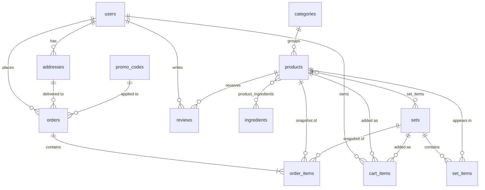

# Проектирование БД — Пряня

Документ для курсовой работы по базам данных. Описывает структуру БД интернет-магазина пряников «Пряня»: сущности, связи, ограничения, индексы, триггеры.

СУБД: **PostgreSQL 15+**.

---

## 1. Сущности

| # | Таблица | Назначение |
|---|---|---|
| 1 | `users` | Зарегистрированные пользователи |
| 2 | `categories` | Категории пряников (Классика / Премиум / Сезонные) |
| 3 | `products` | 12 пряников |
| 4 | `ingredients` | Справочник ингредиентов |
| 5 | `product_ingredients` | M:N связь продуктов и ингредиентов |
| 6 | `sets` | 4 подарочных сета |
| 7 | `set_items` | M:N связь сетов и продуктов |
| 8 | `promo_codes` | Промокоды |
| 9 | `reviews` | Отзывы пользователей о пряниках |
| 10 | `addresses` | Адреса доставки пользователей |
| 11 | `orders` | Заказы |
| 12 | `order_items` | Позиции заказов (со снапшотом данных) |
| 13 | `cart_items` | Серверная корзина залогиненных пользователей |
| 14 | `faq_items` | Часто задаваемые вопросы |
| 15 | `team_members` | Команда (для страницы «О нас») |

---

## 2. ER-диаграмма



---

## 3. Описание таблиц

### 3.1 `users` — пользователи
| Поле | Тип | Ограничения | Описание |
|---|---|---|---|
| id | SERIAL | PK | |
| email | VARCHAR(255) | NOT NULL, UNIQUE | |
| password_hash | VARCHAR(255) | NOT NULL | bcrypt-хэш |
| name | VARCHAR(100) | NOT NULL | |
| avatar | VARCHAR(255) | NULL | URL или эмодзи |
| created_at | TIMESTAMPTZ | NOT NULL DEFAULT NOW() | |

**Индексы:** `idx_users_email` UNIQUE на `email`.

### 3.2 `categories` — категории пряников
| Поле | Тип | Ограничения |
|---|---|---|
| id | SERIAL | PK |
| name | VARCHAR(50) | NOT NULL, UNIQUE |
| slug | VARCHAR(50) | NOT NULL, UNIQUE |

Заполнение: `Классика`, `Премиум`, `Сезонные`.

### 3.3 `products` — пряники
| Поле | Тип | Ограничения | Описание |
|---|---|---|---|
| id | SERIAL | PK | |
| name | VARCHAR(200) | NOT NULL | |
| price | NUMERIC(10,2) | NOT NULL, CHECK (price > 0) | |
| old_price | NUMERIC(10,2) | NULL, CHECK (old_price > price) | старая цена для зачёркивания |
| category_id | INTEGER | NOT NULL, FK → categories(id) ON DELETE RESTRICT | |
| photo | VARCHAR(255) | NOT NULL | путь к фото |
| badge | badge_type (enum) | NULL | «Хит» / «Новинка» / «Сезонный» / «Премиум» |
| description | TEXT | NOT NULL | |
| brand_bg | CHAR(7) | NOT NULL | HEX-цвет, например `#F472B6` |
| brand_is_dark | BOOLEAN | NOT NULL DEFAULT FALSE | тёмный ли фон |
| rating_avg | NUMERIC(2,1) | NOT NULL DEFAULT 0.0 | денормализованный кэш |
| reviews_count | INTEGER | NOT NULL DEFAULT 0 | денормализованный кэш |
| created_at | TIMESTAMPTZ | NOT NULL DEFAULT NOW() | |

**Индексы:** `idx_products_category` на `category_id`, `idx_products_badge` на `badge` WHERE badge IS NOT NULL.

### 3.4 `ingredients` — справочник ингредиентов
| Поле | Тип | Ограничения |
|---|---|---|
| id | SERIAL | PK |
| name | VARCHAR(100) | NOT NULL, UNIQUE |

### 3.5 `product_ingredients` — состав пряников (M:N)
| Поле | Тип | Ограничения |
|---|---|---|
| product_id | INTEGER | FK → products(id) ON DELETE CASCADE |
| ingredient_id | INTEGER | FK → ingredients(id) ON DELETE RESTRICT |
| position | SMALLINT | NOT NULL, DEFAULT 0 — порядок в списке |

**PK:** `(product_id, ingredient_id)`.

### 3.6 `sets` — подарочные сеты
| Поле | Тип | Ограничения |
|---|---|---|
| id | SERIAL | PK |
| name | VARCHAR(200) | NOT NULL |
| count | SMALLINT | NOT NULL, CHECK (count > 0) |
| price | NUMERIC(10,2) | NOT NULL, CHECK (price > 0) |
| old_price | NUMERIC(10,2) | NULL, CHECK (old_price > price) |
| description | TEXT | NOT NULL |
| photo | VARCHAR(255) | NULL |
| is_featured | BOOLEAN | NOT NULL DEFAULT FALSE |

### 3.7 `set_items` — состав сетов (M:N)
| Поле | Тип | Ограничения |
|---|---|---|
| set_id | INTEGER | FK → sets(id) ON DELETE CASCADE |
| product_id | INTEGER | FK → products(id) ON DELETE RESTRICT |
| qty | SMALLINT | NOT NULL DEFAULT 1, CHECK (qty > 0) |

**PK:** `(set_id, product_id)`.

### 3.8 `promo_codes` — промокоды
| Поле | Тип | Ограничения |
|---|---|---|
| code | VARCHAR(50) | PK |
| discount | NUMERIC(4,3) | NOT NULL, CHECK (discount > 0 AND discount < 1) |
| is_active | BOOLEAN | NOT NULL DEFAULT TRUE |
| valid_until | TIMESTAMPTZ | NULL |

Заполнение: `PRANYA10` (0.10), `WELCOME` (0.15), `SWEET` (0.05).

### 3.9 `reviews` — отзывы
| Поле | Тип | Ограничения |
|---|---|---|
| id | SERIAL | PK |
| product_id | INTEGER | NOT NULL, FK → products(id) ON DELETE CASCADE |
| user_id | INTEGER | NOT NULL, FK → users(id) ON DELETE CASCADE |
| rating | SMALLINT | NOT NULL, CHECK (rating BETWEEN 1 AND 5) |
| text | TEXT | NULL |
| created_at | TIMESTAMPTZ | NOT NULL DEFAULT NOW() |

**Уникальный индекс:** `(product_id, user_id)` — один отзыв от пользователя на пряник.

**Связан с триггером** для пересчёта `products.rating_avg` и `products.reviews_count` (см. раздел 5).

### 3.10 `addresses` — адреса
| Поле | Тип | Ограничения |
|---|---|---|
| id | SERIAL | PK |
| user_id | INTEGER | NOT NULL, FK → users(id) ON DELETE CASCADE |
| city | VARCHAR(100) | NOT NULL |
| street | VARCHAR(200) | NOT NULL |
| building | VARCHAR(20) | NOT NULL |
| apartment | VARCHAR(20) | NULL |
| postal_code | VARCHAR(20) | NULL |
| is_default | BOOLEAN | NOT NULL DEFAULT FALSE |

### 3.11 `orders` — заказы
| Поле | Тип | Ограничения |
|---|---|---|
| id | SERIAL | PK (отображается в UI как `#PR-{id:0000}`) |
| user_id | INTEGER | NOT NULL, FK → users(id) ON DELETE RESTRICT |
| status | order_status (enum) | NOT NULL DEFAULT 'В работе' |
| subtotal | NUMERIC(10,2) | NOT NULL, CHECK (subtotal >= 0) |
| discount | NUMERIC(10,2) | NOT NULL DEFAULT 0, CHECK (discount >= 0) |
| total | NUMERIC(10,2) | NOT NULL, CHECK (total >= 0) |
| promo_code | VARCHAR(50) | NULL, FK → promo_codes(code) ON DELETE SET NULL |
| address_id | INTEGER | NULL, FK → addresses(id) ON DELETE SET NULL |
| notes | TEXT | NULL |
| created_at | TIMESTAMPTZ | NOT NULL DEFAULT NOW() |
| updated_at | TIMESTAMPTZ | NOT NULL DEFAULT NOW() |

**Индексы:** `idx_orders_user` на `user_id`, `idx_orders_created` на `created_at DESC`.

### 3.12 `order_items` — позиции заказа (со снапшотом)
| Поле | Тип | Ограничения |
|---|---|---|
| id | SERIAL | PK |
| order_id | INTEGER | NOT NULL, FK → orders(id) ON DELETE CASCADE |
| product_id | INTEGER | NULL, FK → products(id) ON DELETE SET NULL |
| set_id | INTEGER | NULL, FK → sets(id) ON DELETE SET NULL |
| name_snap | VARCHAR(200) | NOT NULL |
| price_snap | NUMERIC(10,2) | NOT NULL |
| photo_snap | VARCHAR(255) | NULL |
| qty | SMALLINT | NOT NULL, CHECK (qty > 0) |

**CHECK (только одно из двух):** `((product_id IS NOT NULL)::INT + (set_id IS NOT NULL)::INT) = 1`.

**Зачем снапшот:** если пряник переименуют или поменяют цену, в исторических заказах останется как было на момент покупки.

### 3.13 `cart_items` — серверная корзина
| Поле | Тип | Ограничения |
|---|---|---|
| id | SERIAL | PK |
| user_id | INTEGER | NOT NULL, FK → users(id) ON DELETE CASCADE |
| product_id | INTEGER | NULL, FK → products(id) ON DELETE CASCADE |
| set_id | INTEGER | NULL, FK → sets(id) ON DELETE CASCADE |
| qty | SMALLINT | NOT NULL DEFAULT 1, CHECK (qty > 0) |
| created_at | TIMESTAMPTZ | NOT NULL DEFAULT NOW() |

**CHECK:** ровно один из `product_id` / `set_id` не NULL.
**Индекс:** `idx_cart_user` на `user_id`.

Гостевая корзина живёт в `localStorage` на клиенте; при логине — мерджится в серверную.

### 3.14 `faq_items` — FAQ
| Поле | Тип |
|---|---|
| id | SERIAL PK |
| question | TEXT NOT NULL |
| answer | TEXT NOT NULL |
| position | SMALLINT NOT NULL DEFAULT 0 |

### 3.15 `team_members` — команда
| Поле | Тип |
|---|---|
| id | SERIAL PK |
| name | VARCHAR(100) NOT NULL |
| role | VARCHAR(100) NOT NULL |
| position | SMALLINT NOT NULL DEFAULT 0 |

---

## 4. ENUM-типы

```sql
CREATE TYPE badge_type AS ENUM ('Хит', 'Новинка', 'Сезонный', 'Премиум');
CREATE TYPE order_status AS ENUM ('В работе', 'Собирается', 'В пути', 'Доставлен');
```

---

## 5. Триггеры

### Пересчёт рейтинга пряника при изменении отзывов

```sql
CREATE OR REPLACE FUNCTION recalc_product_rating()
RETURNS TRIGGER AS $$
DECLARE
    target_product_id INTEGER;
BEGIN
    target_product_id := COALESCE(NEW.product_id, OLD.product_id);

    UPDATE products
    SET
        rating_avg = COALESCE((
            SELECT ROUND(AVG(rating)::NUMERIC, 1)
            FROM reviews
            WHERE product_id = target_product_id
        ), 0),
        reviews_count = (
            SELECT COUNT(*) FROM reviews
            WHERE product_id = target_product_id
        )
    WHERE id = target_product_id;

    RETURN NULL;
END;
$$ LANGUAGE plpgsql;

CREATE TRIGGER trg_reviews_recalc
AFTER INSERT OR UPDATE OR DELETE ON reviews
FOR EACH ROW EXECUTE FUNCTION recalc_product_rating();
```

### Автообновление `orders.updated_at`

```sql
CREATE OR REPLACE FUNCTION set_updated_at()
RETURNS TRIGGER AS $$
BEGIN
    NEW.updated_at := NOW();
    RETURN NEW;
END;
$$ LANGUAGE plpgsql;

CREATE TRIGGER trg_orders_updated_at
BEFORE UPDATE ON orders
FOR EACH ROW EXECUTE FUNCTION set_updated_at();
```

---

## 6. Нормализация

Схема в **3НФ (BCNF где возможно)**:

- **1НФ:** все атрибуты атомарны. `product_ingredients` и `set_items` устраняют повторяющиеся группы.
- **2НФ:** каждый неключевой атрибут зависит от всего ключа. В `order_items` снапшот (`name_snap`, `price_snap`, `photo_snap`) — намеренная денормализация для исторической корректности.
- **3НФ:** нет транзитивных зависимостей. Категории, ингредиенты, промокоды — выделены в свои таблицы.

**Намеренные денормализации:**
1. `products.rating_avg` и `products.reviews_count` — кэш агрегации `reviews`, поддерживается триггером.
2. `order_items.name_snap` / `price_snap` / `photo_snap` — снимок данных на момент заказа.

---

## 7. Индексы — сводно

| Индекс | Таблица | Поля | Тип |
|---|---|---|---|
| idx_users_email | users | email | UNIQUE B-tree |
| idx_products_category | products | category_id | B-tree |
| idx_products_badge | products | badge | partial (WHERE badge IS NOT NULL) |
| idx_reviews_product_user | reviews | (product_id, user_id) | UNIQUE B-tree |
| idx_orders_user | orders | user_id | B-tree |
| idx_orders_created | orders | created_at DESC | B-tree |
| idx_cart_user | cart_items | user_id | B-tree |

---

## 8. Связи и каскады

| Связь | ON DELETE | Обоснование |
|---|---|---|
| `products.category_id → categories` | RESTRICT | Нельзя удалить категорию, пока в ней есть товары |
| `product_ingredients.product_id → products` | CASCADE | Удаление продукта чистит его состав |
| `product_ingredients.ingredient_id → ingredients` | RESTRICT | Нельзя удалить ингредиент, пока он используется |
| `set_items.set_id → sets` | CASCADE | Удаление сета чистит его состав |
| `set_items.product_id → products` | RESTRICT | Нельзя удалить продукт, пока он в сете |
| `reviews.product_id → products` | CASCADE | Удалили продукт — отзывы тоже |
| `reviews.user_id → users` | CASCADE | Удалили юзера — отзывы тоже |
| `addresses.user_id → users` | CASCADE | |
| `orders.user_id → users` | RESTRICT | История заказов сохраняется |
| `orders.address_id → addresses` | SET NULL | Адрес можно удалить, заказ останется без адреса |
| `orders.promo_code → promo_codes` | SET NULL | Промокод можно деактивировать |
| `order_items.order_id → orders` | CASCADE | |
| `order_items.product_id / set_id` | SET NULL | Снапшот сохраняет данные |
| `cart_items.*` | CASCADE | Чистим корзину при удалении любого FK |
